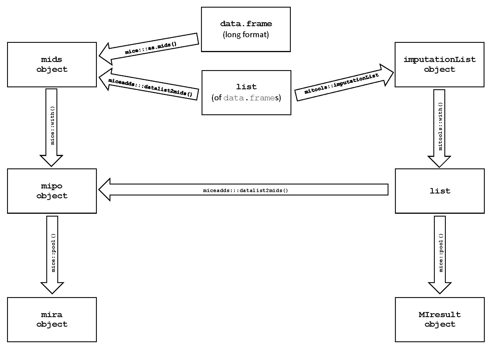

```{r, include = F}
if (names(rmarkdown::metadata$output) == "learnr::tutorial") {
  library(learnr)
  learnr::initialize_tutorial()
  static <- FALSE
}

if (names(rmarkdown::metadata$output) == "html_document") {
  knitr::opts_hooks$set(eval = function(opt) {
    if (any(opt$exercise, opt$eval == FALSE))
      opt$eval <- opt$include <- FALSE
    
    opt
  })
  
  static <- TRUE
}
```

```{r packages, include = FALSE}
library(JointAI)
library(jomo)
library(lme4)
library(mice)
library(nlme)
library(smcfcs)
library(survival)

library(magrittr)
library(knitr)
library(kableExtra)
```

```{r data, include = FALSE, context = "data"}

# NHANES data
load("www/NHANES.RData")
NHANES$alc_bin <- factor(ifelse(NHANES$alc %in% c("0", "<=1"), "<=1",
                                ifelse(is.na(NHANES$alc), NA, ">1")))

NHANES <- subset(NHANES, select = c("age", "gender", "BMI", "height",
                                    "weight", "smoke", "alc_bin", "hypten"),
                 subset = !is.na(hypten))

set.seed(2018)
sub <- sample(nrow(NHANES), 750, 
              prob = c(4/5, 1/5)[as.numeric(complete.cases(NHANES)) + 1])
NHANES <- NHANES[sub, ]


# pbcdata
pbcdat <- subset(pbc, 
                 select = c("time", "status", "platelet", "age",
                            "sex", "chol", "stage"))
pbcdat$status <- factor(pbcdat$status,
                        levels = 0:2,
                        labels = c("censored", "transplant", "dead"))
pbcdat$stage <- factor(pbcdat$stage, ordered = TRUE)

pbcdat$time <- as.numeric(pbcdat$time)
pbcdat$platelet <- as.numeric(pbcdat$platelet)
pbcdat$chol <- as.numeric(pbcdat$chol)

```

```{r savemodels, echo = FALSE, eval = FALSE}

set.seed(2018)
JointAIlog <- glm_imp(hypten ~ age + BMI + gender * (smoke + alc_bin),
           family = binomial(link = 'logit'), data = NHANES, n.iter = 500,
           auxvars = c("height", "weight"),
           inits = NULL)


NHANES$hypten_num <- as.numeric(NHANES$hypten) - 1
pred <- matrix(nrow = ncol(NHANES), ncol = ncol(NHANES), data = 1,
               dimnames = list(names(NHANES), names(NHANES)))
diag(pred) <- 0
pred[, c("hypten_num", "hypten")] <- 0
pred[c("height", "weight"), "BMI"] <- 0


set.seed(2018)
smclog <- smcfcs(NHANES,
                 smtype = "logistic",
                 smformula = "hypten_num ~ age + BMI + (smoke + alc_bin) * gender",
                 method = c("", "", "I(weight/height^2)", "norm", "norm",
                            "podds", "logreg", "", ""), 
                 predictorMatrix = pred,
                 numit = 20)

par(mfrow = c(3, 4), mar = c(3.5, 3.5, 1,1), mgp = c(2, 0.6, 0))
for (i in 1:dim(smclog$smCoefIter)[2]) {
  matplot(t(smclog$smCoefIter[, i, ]), type = 'l', ylab = "coefficient", 
          xlab = "iteration")
}


set.seed(2018)
jomolog <- jomo.glm(hypten ~ age + BMI + gender + smoke + alc_bin,
                    data = NHANES[, c("hypten", "age", "BMI", "gender", "smoke", "alc_bin")], 
                    family = "binomial", nburn = 1000, 
                    nbetween = 50, nimp = 5)

jomologMCMC <- jomo.glm.MCMCchain(hypten ~ age + BMI + gender + smoke + alc_bin,
                    data = NHANES, 
                    family = "binomial", nburn = 1000)

par(mfrow = c(2,4), mar = c(3,3,1,1), mgp = c(2, 0.6, 0))
for (i in 1:dim(jomologMCMC$collectbeta)[2]) {
  plot(jomologMCMC$collectbeta[1, i, ], type = 'l')
}

par(mfrow = c(2,4), mar = c(3,3,1,1), mgp = c(2, 0.6, 0))
for (i in 1:dim(jomologMCMC$collectbetaY)[2]) {
  plot(jomologMCMC$collectbetaY[1, i, ], type = 'l')
}


par(mfrow = c(6, 6), mar = c(3,3,1,1), mgp = c(2, 0.6, 0))
for (i in 1:dim(jomologMCMC$collectomega)[2]) {
  for (j in 1:i) {
    plot(jomologMCMC$collectomega[i, j , ], type = 'l')
  }
}

matplot(t(jomologMCMC$collectbeta[1, , ]), type = 'l')

save(JointAIlog, smclog, jomolog, 
     file = "Practicals/MICEadvanced/www/logimps.RData")


pbcdat$event <- as.numeric(pbcdat$status == 'dead')
set.seed(2018)
smcsurv <- smcfcs(originaldata = pbcdat,
                  smtype = "coxph", 
                  smformula = "Surv(time = time, event) ~ platelet + 
                               age + sex + chol + stage",
                  method = c("", "", "norm", "", "", "norm", "podds", ""),
                  rjlimit = 1500, numit = 20)

save(smcsurv, file = "Practicals/MICEadvanced/www/survimps.RData")

```

```{r loadmodels, echo = FALSE, context = "data"}
load("www/survimps.RData")
load("www/logimps.RData")
```

## Non-linear functional forms
To practice imputation when non-linear functional forms or interaction terms
are involved, we use a subset of the **NHANES** data.

### NHANES data
The variables in this subset have the following distribution:
```{r distrNHANES, echo = FALSE, fig.width = 9, fig.height = 4.5}
nc <- 4
nr <- 2

par(mfrow = c(nr, nc), mgp = c(2, 0.6, 0), mar = c(2, 3, 3, 0.5))

for (i in 1:ncol(NHANES)) {
  if (is.numeric(NHANES[, i])) {
    hist(NHANES[, i], nclass = 50, xlab = "",
         main = paste0(names(NHANES[i]), " (",
                       round(mean(is.na(NHANES[, i])) * 100, 2), "% NA)")
    )
  } else {
    cattab <- table(NHANES[, i], exclude = NULL)
    names(cattab)[is.na(names(cattab))] <- "NA"
    barplot(cattab, ylab = "Frequency",
            main = paste0(names(NHANES[i]), " (",
                          round(mean(is.na(NHANES[, i])) * 100, 2), "% NA)"))
  }
}
```


The **missing data pattern** is

```{r NHANESmdpat, echo = FALSE}
par(mar = c(4, 1, 1, 3), mgp = c(2, 0.6, 0))
md_pattern(NHANES, yaxis_pars = list(yaxt = 'n'), printN = FALSE)
```


We are interested to fit the following **logistic regression model for
hypertension**. We expect that the effects of smoking and alcohol consumption
may differ beteween men and women, and, hence, include **interaction terms**
between `gender` and `smoke` and `alc_bin`, respectively.

```{r NHANESmodel, eval = FALSE}
mod <- glm(hypten ~ age + BMI + (smoke + alc_bin) * gender,
           family = binomial(link = 'logit'))

```


### JointAI
The package **JointAI** performs analysis and imputation jointly.
There are three main functions, `lm_imp()`, `glm_imp()` and `lme_imp()` that
perform linear regression, generalized linear regression and linear mixed
model regression. The specification of these functions is very similar to the use
of their complete
data versions `lm()`, `glm()` and `lme` (from the **nlme** package).

Check the [help file](https://www.rdocumentation.org/packages/JointAI/versions/0.1.0/topics/model_imp)
for `glm_imp()` to find out which arguments you need to specify to fit the 
logistic regression model for hypertension.

```{r, eval = !static, echo = FALSE}
asis_output("###\\n")
```

`lm_imp()`, `glm_imp()` and `lme_imp()` have many arguments, but not all of 
them are relevant for this practical. The most important arguments are:
```{r JointAIargs, echo = FALSE}
JointAIargs <- rbind(
  c("`formula`", "model formula"),
  c("`data`", "original, incomplete dataset"),
  c("`n.chains`", "number of MCMC chains"),
  c("`n.adapt`", "number of iterations used in the adaptive phase (details see below)"),
  c("`n.iter`", "number of iterations per MCMC chain in the sampling phase"),
  c("`auxvars`", paste0("vector of names of variables that are not part of the analysis",
                        " model but should be used to predict missing values (optional)")),
  c("`refcats`", "allows to specify which category of categorical variables is used as reference (optional)")
) %>% as.data.frame

names(JointAIargs) <- c("", "")

JointAIargs %>% kable(format = 'html') %>%
  kable_styling()

```


<b>Additional details:</b>
<br>
Contrary to MICE, the `n.chains` different MCMC chains are not used to create
multiple imputed datasets.
Multiple chains are necessary to evaluate if the model has converged.
For the final result the chains are combined.

Depending on the type of variable, different types of samplers (within the
Gibbs sampling) are used. JAGS (which is called from within `glm_imp()`)
needs an adaptive phase to find a suitable sampler for each of the parameters. 
Often `n.adapt = 100` iterations (the default value) are sufficient for the 
adaption phase.
These iterations are not included in the final result.

The number of iterations `n.iter` that is required depends on the specific
data and how complex the model is, hence, no default value is given.


```{r, eval = !static, echo = FALSE}
asis_output("###\\n")
```

Analyze (and impute) the data using `glm_imp()` and the logistic regression model
specified above.

* Start with a small number of iterations, say `n.iter = 100`, to get an idea 
  about the computational time.
* Check convergence of the MCMC chains using `traceplot()`.
* Increase `n.iter` if necessary.


`traceplot()` shows by default the MCMC chains of the main model parameters.
This is different to the traceplots we have seen when using `mice()`, but the
principle of convergence is the same.


The result of the model can be displayed with the function `summary()`. 
<!-- To exclude parts of the MCMC chains from the result (if the ) part of the MCMC chains after  -->
<!-- convergence was achieved, the argument `start` can be used to -->
<!-- specify the first iteration to be used. See an example in the  -->
<!-- [help page](https://www.rdocumentation.org/packages/JointAI/versions/0.1.0/topics/summary.JointAI) -->
<!-- of the `summary()` for `JointAI` objects. -->

<div style="border:1px; border-style:solid; padding: 1em; border-color:#1F78B4">
Note: Due to a bug in the current version of **JointAI** you need to specify
`inits = NULL`. This bug will be resolved in the next version of the package.
</div>

```{r fitJointAIlog, exercise = TRUE, timelimit.exercise = 200, fig.width = 9, fig.height = 4.5}
library(JointAI)
JointAIlog <- ...


```

```{r fitJointAIlog-hint-1}
# You need to specify the 
# * model formula
# * the distributio family of the outcome
# * the dataset
# * auxiliary variables
# * the number of iterations for the sample
# * set inits = NULL
```

```{r, fitJointAIlog-solution}
library(JointAI)
JointAIlog <- glm_imp(hypten ~ age + BMI + (smoke + alc_bin) * gender,
                  family = binomial(link = 'logit'),
                  data = NHANES,
                  auxvars = c("weight", "height"),
                  n.iter = 100, inits = NULL)

traceplot(JointAIlog)

summary(JointAIlog)
```


```{r, eval = !static, echo = FALSE}
asis_output("###\\n")
```


### smcfcs
The package **smcfcs** performs imputation using
"substantive model compatible fully conditional specification".

The main function is called `smcfcs()` and its use is similar to the use
of `mice()`. Check the [help file](https://www.rdocumentation.org/packages/smcfcs/versions/1.3.0/topics/smcfcs)
to find out the details of this function.

```{r, eval = !static, echo = FALSE}
asis_output("###\\n")
```


`smcfcs()` takes the following arguments as input:
```{r smcargs, echo = FALSE}
smctab <- rbind(
  c("`originaldata`", "original, incomplete data frame"),
  c("`smtype`", paste0("type of substantive (analysis) model: `lm`, `logistic`, ",
                       "`poisson`, `coxph` or `compet`")),
  c("`smformula`", "formula of analysis model"),
  c("`method`", paste0("vector of imputation methods for each variable: ",
                       "`norm` (lin. regression), `logreg` (logistic regression), ",
                       "`poisson` (Poisson regression),",
                       "`podds` (prop. odds regression for ordered factors,",
                       "`mlogit` (multinomial logistic regression for unordered factors) ",
                       "`''` if variable is complete, or a custom expression ",
                       "to impute passively imputed variables, e.g. `'x^2'` or `x1*x2`")),
  c("`predictorMatrix`", paste0("predictor matrix to define which variables ",
                                "are used as predictors in which imputation ",
                                "model (optional). **The outcome must not be included**")),
  c("`m`", "number of imputed datasets (default is 5)"),
  c("`numit`", "number of iterations before obtaining imputed dataset"),
  c("`rjlimit`", "maximum number of attempts in the rejection sampling (MCMC)"),
  c("`noisy`", "if `TRUE`: output is printed, if `FALSE`: less output is printed")
) %>% as.data.frame

names(smctab) <- c("", "")

smctab %>% kable(format = 'html') %>%
  kable_styling()
```

<b>Additional details:</b>
<br>

The vector of imputation methods needs to be specified in the order of
the columns in the dataset and contain an entry for each column, even that 
column is not used in the imputation model.
Depending on whether additional columns of the data should be used as auxiliary
variables in the imputation, the `predictorMatrix` needs to be adjusted (0 if
the column should not be used, 1 if it should be used).

In `smcfcs()` the outcome of the analysis model is implicitely included in the
imputation model, similarily to how it is included in **JointAI**. Therefore,
the outcome does not need to be explicitely specified as predictor variable
for the imputation models in the `predictorMatrix`.

**smcfcs** uses *rejection sampling*. Rejection sampling is a method to create
a random sample from a complex distribution (from which we can not sample directly)
by drawing from a simpler proposal distribution and rejecting draws that are unlikely
under the complex target distribution.
The argument `rjlimit` specifies how many attepts are made to draw a value from
the proposal that is not rejected.

Impute the NHANES data with `smcfcs()` and take the following into account
* `smcfcs` requires the outcome to be coded as numeric (with values 0 and 1),
  => you will have to create a new variable `hypten_num`
* The original outcoma variable `hypten` should not be used as predictor variable,
  => you need to create `predictorMatrix` to exclude it
* `BMI` should not be used to impute `height` and `weight`

```{r runsmclog, exercise = TRUE, timelimit.exercise = 200}
# create the numeric version of hypten
...

# create the predictor Matrix
...

# run the imputation
smclog <- ...
```


```{r runsmclog-hint-1}
# To create the numeric version of "hypten" use
NHANES$hypten_num <- as.numeric(NHANES$hypten) - 1
```

```{r runsmclog-hint-2}
# To create the predictor matrix:
pred <- matrix(nrow = ncol(NHANES), ncol = ncol(NHANES), data = 1,
               dimnames = list(names(NHANES), names(NHANES)))
# exclude variables from their own imputation model
diag(pred) <- 0

# exclude hypten from all imputation models
pred[, c("hypten_num", "hypten")] <- 0

# exclude BMI from the models for height and weight
pred[c("height", "weight"), "BMI"] <- 0

```


```{r runsmclog-hint-3}
# In smcfcs() you need to specify 
# * the data
# * the model type
# * the model formula
# * the vector of imputation methods
# * possibly the number of iterations
```


```{r runsmclog-solution}
NHANES$hypten_num <- as.numeric(NHANES$hypten) - 1


pred <- matrix(nrow = ncol(NHANES), ncol = ncol(NHANES), data = 1,
               dimnames = list(names(NHANES), names(NHANES)))
diag(pred) <- 0
pred[, c("hypten_num", "hypten")] <- 0
pred[c("height", "weight"), "BMI"] <- 0


smclog <- smcfcs(NHANES,
                 smtype = "logistic",
                 smformula = "hypten_num ~ age + BMI + (smoke + alc_bin) * gender",
                 method = c("", "", "I(weight/height^2)", "norm", "norm",
                            "podds", "logreg", "", ""),
                 predictorMatrix = pred, numit = 20)

```


Find out the `class` of the object returned by `smcfcs()` and its elements.
The section **Value** in the [help file](https://www.rdocumentation.org/packages/smcfcs/versions/1.3.0/topics/smcfcs)
can help with this.
Then plot the chains of the estimated model parameters to evaluate if the
algorithm has converged.
```{r conv_smclog, exercise = TRUE, fig.width = 9, fig.height = 6}

```


```{r conv_smclog-hint-1}
# The estimates of the model parameters from each iteration are returned
# in the list element "smCoefIter".
```


```{r conv_smclog-solution, fig.width = 9, fig.height = 6}
# class of the returned object
class(smclog)
# names of its components
names(smclog)

# investigate the first component
class(smclog$impDatasets)
length(smclog$impDatasets)
class(smclog$impDatasets[[1]])
dim(smclog$impDatasets[[1]])

# investigate the second component
class(smclog$smCoefIter)
dim(smclog$smCoefIter)


# plot the chains of estimated coefficients
par(mfrow = c(3, 4), mar = c(3.5, 3.5, 1,1), mgp = c(2, 0.6, 0))
for (i in 1:dim(smclog$smCoefIter)[2]) {
  matplot(t(smclog$smCoefIter[, i, ]), type = 'l', ylab = "coefficient", 
          xlab = "iteration")
}
```


```{r, eval = !static, echo = FALSE}
asis_output("###\\n")
```


The imputed datasets are returned as a list, where each element of the list is
one imputed dataset.

To get from a list of datasets to pooled results there are several options, as
displayed in the following flow chart:



```{r flowchart, echo = FALSE, eval = FALSE}
library(diagram)
height <- 23
width <- 15

boxwidth <- 1.5
title_height <- 0.7
box_height <- 1.5

pos_left <- 1.5
pos_mid <- 7.5
pos_right <- 13.5

title_skip <- -3
ypos_left <- -0
ypos_mid <- -3
ypos_right <- -5
yskip <- 6

cex_flow <- 1

titel_LTxMain <- as.list(c("mids", "mira", "mipo"))
titel_rPSC <- as.list(c("data.frame (long)", "list"))
titel_LTxrPSC <- as.list(c("imputationList", "list", "MIresult"))

par(mar = rep(0.5, 4))
openplotmat(xlim = c(0, width),
            ylim = c(0, height - 3), main = "")
for (i in 1:length(titel_LTxMain)) {
  textrect(mid = c(pos_left,
                   height - i*yskip + ypos_left + title_skip),
           radx = boxwidth,
           rady = box_height,
           lab = titel_LTxMain[i],
           cex = cex_flow)
  
  straightarrow(from = c(pos_left,
                         height - i*yskip + ypos_left + title_skip + 4.5),
                to = c(pos_left,
                       height - i*yskip + ypos_left + title_skip - 0.5),
                endhead = T, arr.type = "triangle", arr.length = 0.3)
}

for (i in 1:length(titel_rPSC)) {
  textrect(mid = c(pos_mid,
                   height - i*yskip*0.6 + ypos_mid),
           radx = boxwidth,
           rady = box_height,
           lab = titel_rPSC[i],
           cex = cex_flow)
  # straightarrow(from  = c(pos_right - 0.5, 
  #                         height - i*yskip + ypos_left + title_skip),
  #               to = c(pos_left - boxwidth,
  #                      height - i*yskip + ypos_left + title_skip),
  #               endhead = T, arr.type = "triangle", arr.length = 0.3)
}

straightarrow(from = c(pos_right, 
                        height - i*yskip + ypos_left + title_skip),
              to = c(-7,
                     height - i*yskip + ypos_left + title_skip),
              endhead = T, arr.type = "triangle", arr.length = 0.3)

straightarrow(from = c(pos_mid - boxwidth, 
                        height - 0.1*yskip + ypos_mid + title_skip),
              to = c(pos_left - 1,
                     height - 0.8 * yskip + ypos_mid + title_skip),
              endhead = T, arr.type = "triangle", arr.length = 0.3)

straightarrow(from = c(pos_mid + boxwidth, 
                        height - 0.7*yskip + ypos_mid + title_skip),
              to = c(pos_right + 1,
                     height - 0.8 * yskip + ypos_left + title_skip),
              endhead = T, arr.type = "triangle", arr.length = 0.3)

straightarrow(from = c(pos_mid - boxwidth, 
                        height - 0.7*yskip + ypos_mid + title_skip),
              to = c(pos_left - 1,
                     height - 0.8 * yskip + ypos_left + title_skip),
              endhead = T, arr.type = "triangle", arr.length = 0.3)


for (i in 1:length(titel_LTxrPSC)) {
  textrect(mid = c(pos_right,
                   height - i*yskip + ypos_left + title_skip),
           radx = boxwidth,
           rady = box_height,
           lab = titel_LTxrPSC[i],
           cex = cex_flow)
}

for (i in 2:3) {
  straightarrow(from = c(pos_right,
                         height - i*yskip + ypos_left + title_skip + 4.5),
                to = c(pos_right,
                       height - i*yskip + ypos_left + title_skip - 0.5),
                endhead = T, arr.type = "triangle", arr.length = 0.3)
}

# abline(v = 1:7)
# abline(h = 15)
text(4.5, 16, "as.mids")
text(4.5, 14, "datalist2mids")
```


To use `miceadds::datalist2mids` the ordered factors need to be converted to
unordered factors. To use `as.mids()` we would have to turn the list into
a long format dataset (where the original data and all imputed datasets are
stacked on top of each other) and add
a column that identifies the imputation numer and one that identifies subjects.

Instead:

1. convert `smclog` to an `imputationList` object
2. fit the models on this `imputationList` object
3. use `MICombine()` to obtain an `MIresult` object
4. use `as.mira()` to convert the `list` of models from 2. to a `mira` object
5. use `pool()` on the `mira` object
6. compare the `summary()` of the `mira` object and the `summary()` of the `MIresult` object


```{r pool_smclog, exercise = TRUE}

```


```{r pool_smclog-hint-1}
# 1. convert to imputationList
library(mitools)
smclog_impList <- imputationList(smclog$impDatasets)

```

```{r pool_smclog-hint-2}
# 1. convert to imputationList
library(mitools)
smclog_impList <- imputationList(smclog$impDatasets)

# 2. fit the models
logmod_mitools <- with(smclog_impList, 
                       glm(hypten ~ age + BMI + (smoke + alc_bin) * gender,
                           family = binomial(link = 'logit')))
```

```{r pool_smclog-hint-3}
# 1. convert to imputationList
library(mitools)
smclog_impList <- imputationList(smclog$impDatasets)

# 2. fit the models
logmod_mitools <- with(smclog_impList, 
                       glm(hypten ~ age + BMI + (smoke + alc_bin) * gender,
                           family = binomial(link = 'logit')))

# 3. Pool the results
logpool_mitools <- MIcombine(logmod_mitools)


```


```{r pool_smclog-hint-4}
# 1. convert to imputationList
library(mitools)
smclog_impList <- imputationList(smclog$impDatasets)

# 2. fit the models
logmod_mitools <- with(smclog_impList, 
                       glm(hypten ~ age + BMI + (smoke + alc_bin) * gender,
                           family = binomial(link = 'logit')))

# 3. Pool the results
logpool_mitools <- MIcombine(logmod_mitools)

# 4. create a mira object
smclog_mira <- as.mira(logmod_mitools)
```

```{r pool_smclog-hint-5}
# 1. convert to imputationList
library(mitools)
smclog_impList <- imputationList(smclog$impDatasets)

# 2. fit the models
logmod_mitools <- with(smclog_impList, 
                       glm(hypten ~ age + BMI + (smoke + alc_bin) * gender,
                           family = binomial(link = 'logit')))

# 3. Pool the results
logpool_mitools <- MIcombine(logmod_mitools)

# 4. create a mira object
smclog_mira <- as.mira(logmod_mitools)


# 5. pool the mira object
logpool_mice <- pool(smclog_mira)
```

```{r pool_smclog-solution}
# 1. convert to imputationList
library(mitools)
smclog_impList <- imputationList(smclog$impDatasets)

# 2. fit the models
logmod_mitools <- with(smclog_impList, 
                       glm(hypten ~ age + BMI + (smoke + alc_bin) * gender,
                           family = binomial(link = 'logit')))

# 3. Pool the results
logpool_mitools <- MIcombine(logmod_mitools)

# 4. create a mira object
smclog_mira <- as.mira(logmod_mitools)


# 5. pool the mira object
logpool_mice <- pool(smclog_mira)

# 6. compare the results
summary(logpool_mitools)
summary(logpool_mice)
```


### jomo

The last approach we will use to impute the NHANES data is the joint model 
imputation as implemented in the package **jomo**.

(help page)[https://www.rdocumentation.org/packages/jomo/versions/2.6-1/topics/jomo.glm]

Main arguments
```{r jomoargs, echo = FALSE}
jomoargs <- rbind(
  c("`formula`", "model formula"),
  c("`data`", "the original, incomplete data set"),
  c("`nburn`", "number of burnin iterations"),
  c("`nbetween`" , "Number of iterations between imputations"),
  c("`nimp`", "number of imputations (default is 5)"),
  c("`output`", "if 1: output at end of imputation, if $\neq1$: no output shown"),
  c("`out.iter`", "prints output info each `out.iter` iterations"),
  c("`family`", "either `gaussian` or `binomial` (with a probit link)")
) %>% as.data.frame

names(jomoargs) <- c("", "")

jomoargs %>% kable(format = 'html') %>%
  kable_styling()

```


In **jomo** convergence of the MCMC sampler can not be checked on the same 
object that was used to create the imputed values. Instead, a separate function
has to be used: `jomo.glm.MCMCchain()`. It takes the same arguments as 
`jomo.glm()`, except for `nbetween` and `nimp` (since it only does one imputation).


Run `jomo.glm.MCMCchain()` for our logistic regression of `hypten` and 
investigate the resulting object.
Make plots to evaluate convergence.

```{r runjomolog, exercise = TRUE, fig.width = 9, fig.height = 6, timelimit.exercise = 200}

```

```{r runjomolog-solution, fig.width = 9, fig.height = 6}
jomologMCMC <- jomo.glm.MCMCchain(hypten ~ age + BMI + gender *(smoke + alc_bin),
                    data = NHANES, 
                    family = "binomial", nburn = 1000)


par(mfrow = c(2,4), mar = c(3,3,1,1), mgp = c(2, 0.6, 0))
for (i in 1:dim(jomologMCMC$collectbeta)[2]) {
  plot(jomologMCMC$collectbeta[1, i, ], type = 'l')
}

par(mfrow = c(2,4), mar = c(3,3,1,1), mgp = c(2, 0.6, 0))
for (i in 1:dim(jomologMCMC$collectbetaY)[2]) {
  plot(jomologMCMC$collectbetaY[1, i, ], type = 'l')
}


par(mfrow = c(6, 6), mar = c(3,3,1,1), mgp = c(2, 0.6, 0))
for (i in 1:dim(jomologMCMC$collectomega)[2]) {
  for (j in 1:i) {
    plot(jomologMCMC$collectomega[i, j , ], type = 'l')
  }
}

matplot(t(jomologMCMC$collectbeta[1, , ]), type = 'l')
```


```{r eval = FALSE}

jomolog <- jomo.glm(hypten ~ age + BMI + (smoke + alc_bin) * gender,
                    data = NHANES[, c("hypten", "age", "BMI", "gender", "smoke", "alc_bin")], 
                    family = "binomial", nburn = 1000, 
                    nbetween = 50, nimp = 5)

jomologMCMC <- jomo.glm.MCMCchain(hypten ~ age + BMI + gender + smoke + alc_bin,
                    data = NHANES, 
                    family = "binomial", nburn = 1000)

par(mfrow = c(2,4), mar = c(3,3,1,1), mgp = c(2, 0.6, 0))
for (i in 1:dim(jomologMCMC$collectbeta)[2]) {
  plot(jomologMCMC$collectbeta[1, i, ], type = 'l')
}

par(mfrow = c(2,4), mar = c(3,3,1,1), mgp = c(2, 0.6, 0))
for (i in 1:dim(jomologMCMC$collectbetaY)[2]) {
  plot(jomologMCMC$collectbetaY[1, i, ], type = 'l')
}


par(mfrow = c(6, 6), mar = c(3,3,1,1), mgp = c(2, 0.6, 0))
for (i in 1:dim(jomologMCMC$collectomega)[2]) {
  for (j in 1:i) {
    plot(jomologMCMC$collectomega[i, j , ], type = 'l')
  }
}

matplot(t(jomologMCMC$collectbeta[1, , ]), type = 'l')

```


## Longitudinal data
### Data & Model of interest
### JointAI
### jomo


## Survival data
### Data & Model of interest
We will work with a subset of the **pbc** data, which contains data from 
a trial on primary biliary cirrhosis (PBC) of the liver.

The variables we use in this example are:
```{r, echo = FALSE}
pbctab <- rbind(
  c("time", "number of days between inclusion and death, transplantion, or 
    end of follow-up"),
  c("status", "status at `time` (censored, transplant, dead)"),
  c("age", "patient's  age at intake"),
  c("sex", "patient's sex"),
  c("platelet", "platelet count"),
  c("chol", "serum cholesterol"),
  c("stage", "histologic stage of disease")
) %>% as.data.frame

names(pbctab) <- c("", "")

pbctab %>% kable(format = 'html') %>%
  kable_styling()
```


The observed data have the following distributions:
```{r, echo = FALSE, fig.width = 9, fig.height = 4.5}
nc <- 4
nr <- 2

par(mfrow = c(nr, nc), mgp = c(2, 0.6, 0), mar = c(2, 3, 3, 0.5))

for (i in 1:ncol(pbcdat)) {
  if (is.numeric(pbcdat[, i])) {
    hist(pbcdat[, i], nclass = 50, xlab = "",
         main = paste0(names(pbcdat[i]), " (",
                       round(mean(is.na(pbcdat[, i])) * 100, 2), "% NA)")
    )
  } else {
    cattab <- table(pbcdat[, i], exclude = NULL)
    names(cattab)[is.na(names(cattab))] <- "NA"
    barplot(cattab, ylab = "Frequency",
            main = paste0(names(pbcdat[i]), " (",
                          round(mean(is.na(pbcdat[, i])) * 100, 2), "% NA)"))
  }
}
```

#### Missing data pattern
The missing data pattern is
```{r, echo = FALSE}
par(mar = c(4, 1, 1, 3), mgp = c(2, 0.6, 0))
md_pattern(pbcdat, yaxis_pars = list(yaxt = 'n'))
```

#### Model of interest
We are interested to fit the following model:
```{r, eval = FALSE}
coxph(Surv(time, status == 'dead') ~ platelet + age + sex + chol + stage)
```

### Imputation with smcfcs
We will now imput the data using the R package **smcfcs**.
**smcfcs** has one function for imputation: `smcfcs()`.

#### Parameters
Take a look at the help file for `smcfcs()` and find out which parameters need 
to be specified in this function.
```{r smcfcshelp, exercise = TRUE}

```

```{r, eval = !static, echo = FALSE}
asis_output("###\\n")
```

`smcfcs` takes the following arguments as input:

```{r, echo = FALSE}
smctab <- rbind(
  c("`originaldata`", "original, incomplete data frame"),
  c("`smtype`", paste0("type of substantive (analysis) model: `lm`, `logistic`, ",
                       "`poisson`, `coxph` or `compet`")),
  c("`smformula`", "formula of analysis model"),
  c("`method`", paste0("vector of imputation methods for each variable: ",
                       "`norm` (lin. regression), `logreg` (logistic regression), ",
                       "`poisson` (Poisson regression),",
                       "`podds` (prop. odds regression for ordered factors,",
                       "`mlogit` (multinomial logistic regression for unordered factors) ",
                       "`''` if variable is complete, or a custom expression ",
                       "to impute passively imputed variables, e.g. `'x^2'` or `x1*x2`")),
  c("`predictorMatrix`", paste0("predictor matrix to define which variables ",
                                "are used as predictors in which imputation ",
                                "model (optional). **The outcome must not be included**[^1]")),
  c("`m`", "number of imputed datasets (default is 5)"),
  c("`numit`", "number of iterations before obtaining imputed dataset"),
  c("`rjlimit`", "maximum number of attempts in the rejection sampling (MCMC)"),
  c("`noisy`", "if `TRUE`: output is printed, if `FALSE`: less output is printed")
) 

names(smctab) <- c("", "")

smctab %>% kable(format = 'html') %>%
  kable_styling()
```


#### Imputation model
Specify the imputation model
```{r smcimp, exercise = TRUE, exercise.timelimit = 100}
smcsurv <- ...
```

```{r smcimp-solution}
pbcdat$event <- as.numeric(pbcdat$status == 'dead')


smcsurv <- smcfcs(originaldata = pbcdat,
                  smtype = "coxph", 
                  smformula = "Surv(time = time, event) ~ platelet + 
                               age + sex + chol + stage",
                  method = c("", "", "norm", "", "", "norm", "podds", ""))

```

Investigate the structure of the resulting object.
Use the help file for `smcfcs` to get information about the elements of the output.
```{r smcout, exercise = TRUE, fig.width = 9, fig.height = 4.5}

```

```{r smcout-solution, fig.width = 9, fig.height = 4.5}
names(smcsurv)

sapply(smcsurv, class)

length(smcsurv$impDatasets)

dim(smcsurv$smCoefIter)

par(mfrow = c(2, 4), mar = c(3.5, 3.5, 1,1), mgp = c(2, 0.6, 0))
for (i in 1:dim(smcsurv$smCoefIter)[2]) {
  matplot(t(smcsurv$smCoefIter[, i, ]), type = 'l', ylab = "coefficient", 
          xlab = "iteration")
}
```

#### Fit model on imputed data
```{r makemids, eval = FALSE}
library(miceadds)

# convert the ordered factor "stage" to unordered
smcsurv_list <- lapply(smcsurv$impDatasets, function(x) {
  x$stage <- factor(x$stage, ordered = FALSE)
  x
})

# create mids object or imputationList object
smcsurv_mids <- datalist2mids(smcsurv_list)
smcsurv_impList <- mitools::imputationList(smcsurv$impDatasets)


res1 <- with(smcsurv_mids, coxph(Surv(time = time, event) ~ platelet + 
                               age + sex + chol + stage))

res2 <- with(smcsurv_mids2, coxph(Surv(time = time, event) ~ platelet + 
                               age + sex + chol + stage))

summary(pool(res1))

summary(mitools::MIcombine(res2))
summary(pool(as.mira(res2)))

```

