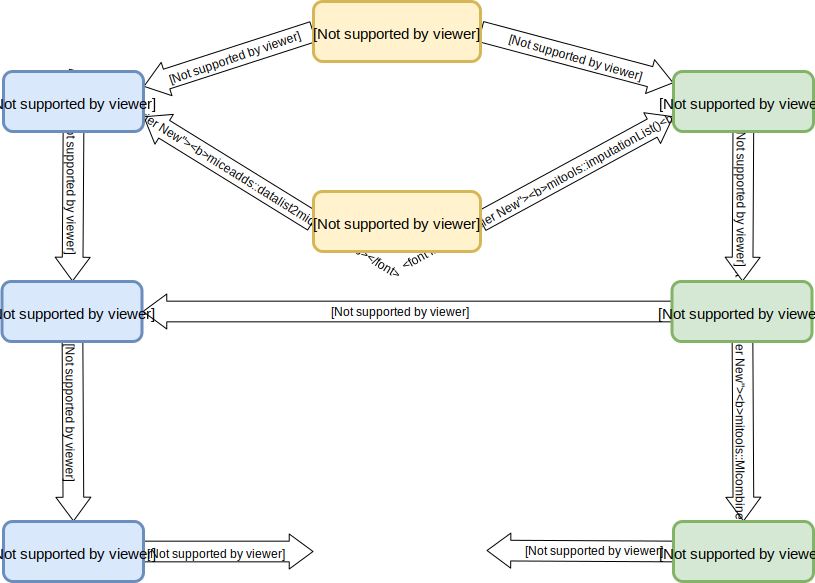

```{r setup-switch, include = F}
if (names(rmarkdown::metadata$output) == "learnr::tutorial") {
  library(learnr)
  learnr::initialize_tutorial()
  static <- FALSE
}

if (names(rmarkdown::metadata$output) == "html_document") {
  knitr::opts_hooks$set(eval = function(opt) {
    if (any(opt$exercise))
      opt$eval <- opt$include <- FALSE
    
    opt
  })
  
  static <- TRUE
}
```

```{r packages, include = FALSE}
library(ggplot2)
library(JointAI)
library(jomo)
library(lme4)
library(mice)
library(miceadds)
library(mitools)
library(nlme)
library(smcfcs)
library(survival)

library(magrittr)
library(knitr)
library(kableExtra)

source("www/probplot.R")
```

```{r data, include = FALSE, context = "data"}
# NHANES data ------------------------------------------------------------------
load("www/NHANES.RData")
NHANES <- subset(NHANES, select = c("weight", "gender", "bili", "age", "chol",
                                    "HDL", "educ", "DBP", "height"),
                 subset = !is.na(weight) & !is.na(educ))

set.seed(2018)
sub <- sample(nrow(NHANES), 750, 
              prob = c(4/5, 1/5)[as.numeric(complete.cases(NHANES)) + 1])
NHANES <- NHANES[sub, ]

NHANES$DBP[is.nan(NHANES$DBP)] <- NA


# pbclong ----------------------------------------------------------------------

pbcseq$year <- pbcseq$day/365.25
pbclong <- subset(pbcseq, select = c("protime", "year", "sex", "trt", "age", "ascites", "bili",
                                    "chol", "albumin", "id"))

pbclong$ascites <- ifelse(sapply(split(pbclong$ascites, pbclong$id), mean) == 0,
                          0, 1)[match(pbclong$id, unique(pbclong$id))]

pbclong$bili <- sapply(split(pbclong$bili, pbclong$id), quantile, 0.1)[match(pbclong$id, unique(pbclong$id))]

pbclong$chol <- sapply(split(pbclong$chol, pbclong$id), function(x) {
                       ifelse(mean(is.na(x)) > 0.5, NA, median(x, na.rm = T))
  })[match(pbclong$id, unique(pbclong$id))]


probs <- with(pbclong[match(unique(pbclong$id), pbclong$id), ],
              plogis(3 * as.numeric(sex) - 0.1 * age + 0.5 * as.numeric(trt)))

set.seed(2018)
pbclong$bili[pbclong$id %in% sample(length(unique(pbclong$id)), prob = probs,
                                    size = length(unique(pbclong$id)) * 0.3)] <- NA

pbclong$trt <- factor(pbclong$trt)
pbclong$ascites <- factor(pbclong$ascites)


# pbcdata ----------------------------------------------------------------------
pbcdat <- subset(pbc, 
                 select = c("time", "status", "platelet", "age",
                            "sex", "chol", "stage"))
pbcdat$status <- factor(pbcdat$status,
                        levels = 0:2,
                        labels = c("censored", "transplant", "dead"))
pbcdat$stage <- factor(pbcdat$stage, ordered = TRUE)

pbcdat$time <- as.numeric(pbcdat$time)
pbcdat$platelet <- as.numeric(pbcdat$platelet)
pbcdat$chol <- as.numeric(pbcdat$chol)

```

```{r savemodels interact, echo = FALSE, eval = FALSE}
# mice
NHANES$agechol <- NHANES$age * NHANES$chol
NHANES$ageHDL <- NHANES$age * NHANES$HDL

miceint0 <- mice(NHANES, maxit = 0)

meth_miceint <- miceint0$method 
pred_miceint <- miceint0$predictorMatrix

# change the imputation method
meth_miceint["DBP"] <- "norm"
meth_miceint <- gsub("pmm", "midastouch", meth_miceint)

# changes in predictor matrix
pred_miceint["chol", "agechol"] <- 0
pred_miceint["HDL", "ageHDL"] <- 0

# changs in imputation method for passive imputation
meth_miceintPAS <- meth_miceint
meth_miceintPAS[c("agechol", "ageHDL")] <- c("~I(age*chol)", "~I(age*HDL)")

miceintJAV <- mice(NHANES, method = meth_miceint, predictorMatrix = pred_miceint,
                maxit = 10, m = 5)

miceintPAS <- mice(NHANES, method = meth_miceintPAS, predictorMatrix = pred_miceint,
                maxit = 10, m = 5)

NHANES <- subset(NHANES, select = -c(agechol, ageHDL))
# JointAI ----------------------------------------------------------------------
set.seed(2018)
t0 <- Sys.time()
JointAIint <- lm_imp(weight ~ gender + bili + age * (chol + HDL) + height,
           data = NHANES, n.iter = 500, inits = NULL,
           auxvars = c("DBP", "educ"))
t1 <- Sys.time()

traceplot(JointAIint)


# smcfcs -----------------------------------------------------------------------
pred <- matrix(nrow = ncol(NHANES), ncol = ncol(NHANES), data = 1,
               dimnames = list(names(NHANES), names(NHANES)))
diag(pred) <- 0

set.seed(2018)
smcint <- smcfcs(NHANES,
                 smtype = "lm",
                 smformula = "weight ~ gender + bili + age * (chol + HDL) + height",
                 method = c(weight = "", gender = "", bili = "norm", age = "",
                            chol = "norm", HDL = "norm", educ = "", DBP = 'norm',
                            height = 'norm'), 
                 predictorMatrix = pred, rjlimit = 5000,
                 numit = 20)

par(mfrow = c(3, 4), mar = c(3.5, 3.5, 1,1), mgp = c(2, 0.6, 0))
for (i in 1:dim(smcint$smCoefIter)[2]) {
  matplot(t(smcint$smCoefIter[, i, ]), type = 'l', ylab = "coefficient", 
          xlab = "iteration")
}


# jomo -------------------------------------------------------------------------
set.seed(2018)
jomoint <- jomo.lm(weight ~ gender + bili + age * (chol + HDL) + height,
                   data = NHANES, nburn = 1000, 
                    nbetween = 200, nimp = 5, output = 0)
t0 <- Sys.time()
jomointMCMC <- jomo.lm.MCMCchain(weight ~ gender + bili + age * (chol + HDL) + height,
                    data = NHANES, nburn = 1000, output = 0)
t1 <- Sys.time()

par(mfrow = c(3,4), mar = c(3,3,1,1), mgp = c(2, 0.6, 0))
for (i in 1:dim(jomointMCMC$collectbeta)[2]) {
  plot(jomointMCMC$collectbeta[1, i, ], type = 'l')
}

par(mfrow = c(3,3), mar = c(3,3,1,1), mgp = c(2, 0.6, 0))
for (i in 1:dim(jomointMCMC$collectbetaY)[2]) {
  plot(jomointMCMC$collectbetaY[1, i, ], type = 'l')
}


par(mfrow = c(6, 6), mar = c(3,3,1,1), mgp = c(2, 0.6, 0))
for (i in 1:dim(jomointMCMC$collectomega)[2]) {
  for (j in 1:i) {
    plot(jomointMCMC$collectomega[i, j , ], type = 'l')
  }
}


save(miceintJAV, miceintPAS, JointAIint, smcint, jomoint, jomointMCMC, 
     file = "Practicals/MIadvanced/www/intimps.RData")
```

```{r savemodels surv, echo = FALSE, eval = FALSE}

pbcdat$event <- pbcdat$status == 'dead'

# mice ------------------------------------------------------------------------
pbcdat$na <- nelsonaalen(data = subset(pbcdat, select = -c(status)),
                         timevar = "time", 
                         statusvar = "event", seed = 2018)

micesurv0 <- mice(pbcdat, maxit = 0)

micesurvmeth <- micesurv0$meth
micesurvpred <- micesurv0$pred

micesurvmeth[c("chol")] <- "midastouch"
micesurvmeth[c("platelet")] <- "norm"

micesurvpred[, "event"] <- 0

micesurv <- mice(pbcdat, predictorMatrix = micesurvpred, maxit = 10, m = 5)

# jomo ------------------------------------------------------------------------

set.seed(2018)
jomosurvMCMC <- jomo.coxph.MCMCchain(formula = Surv(time, event) ~ platelet + 
                                       age + sex + chol + stage,
                                     data = subset(pbcdat, select = -status),
                                     nburn = 2000, output = 0)


par(mfrow = c(3,3), mar = c(3,3,1,1), mgp = c(2, 0.6, 0))
for (i in 1:dim(jomosurvMCMC$collectbeta)[2]) {
  plot(jomosurvMCMC$collectbeta[1, i, ], type = 'l')
}

par(mfrow = c(2,4), mar = c(3,3,1,1), mgp = c(2, 0.6, 0))
for (i in 1:dim(jomosurvMCMC$collectbetaY)[2]) {
  plot(jomosurvMCMC$collectbetaY[1, i, ], type = 'l')
}


par(mfrow = c(5, 6), mar = c(3,3,1,1), mgp = c(2, 0.6, 0))
for (i in 1:dim(jomosurvMCMC$collectomega)[2]) {
  for (j in 1:i) {
    plot(jomosurvMCMC$collectomega[i, j , ], type = 'l')
  }
}

par(mfrow = c(3,3), mar = c(3,3,1,1), mgp = c(2, 0.6, 0))
for (i in 1:dim(jomosurvMCMC$collectbetaY)[2]) {
  plot(jomosurvMCMC$collectbetaY[1, i, ], type = 'l')
}

set.seed(2018)
jomosurv <- jomo.coxph(formula = Surv(time = time, event) ~ platelet + 
                         age + sex + chol + stage,
                       data = subset(pbcdat, select = -status),
                       nburn = 2000, nbetween = 500, nimp = 5)


# smcfcs ------------------------------------------------------------------------
set.seed(2018)
smcsurv <- smcfcs(originaldata = pbcdat,
                  smtype = "coxph", 
                  smformula = "Surv(time = time, event) ~ platelet + 
                               age + sex + chol + stage",
                  method = c(time = "", status = "", 
                             platelet = "norm", age = "", sex = "", 
                             chol = "norm", stage = "podds", event = ""),
                  numit = 20, rjlimit = 1500)


par(mfrow = c(2, 4), mar = c(3.5, 3.5, 1,1), mgp = c(2, 0.6, 0))
for (i in 1:dim(smcsurv$smCoefIter)[2]) {
  matplot(t(smcsurv$smCoefIter[, i, ]), type = 'l', ylab = "coefficient", 
          xlab = "iteration")
}

save(micesurv, jomosurvMCMC, jomosurv, smcsurv,
     file = "Practicals/MICEadvanced/www/survimps.RData")
```

```{r savemodels long, echo = FALSE, eval = FALSE}
# jomo

lvl_jomolong <- c(protime = 1, year = 1, sex = 2, trt = 2, age = 2, ascites = 2,
                  bili = 2, chol = 2, albumin = 1, id = 1)

set.seed(2018)
t0 <- Sys.time()
jomolongMCMC <- jomo.lmer.MCMCchain(protime ~ year + sex + trt + age + ascites +
                                      bili + chol + albumin + (1 + year|id),
                                    data = pbclong,
                                    level = lvl_jomolong, meth = "common", output = 0,
                                    nburn = 6000)
t1 <- Sys.time()

par(mfrow = c(1,2), mar = c(3,3,1,1), mgp = c(2, 0.6, 0))
for (i in 1:dim(jomolongMCMC$collectbeta)[2]) {
  plot(jomolongMCMC$collectbeta[1, i, ], type = 'l')
}

par(mfrow = c(2, 2), mar = c(3,3, 1.5, 1.5), mgp = c(2, 0.6, 0))
for (i in 1:dim(jomolongMCMC$collectomega)[2]) {
  for (j in 1:i) {
    plot(jomolongMCMC$collectomega[i, j , ], type = 'l')
  }
}


par(mfrow = c(4, 5), mar = c(3,3,1.5,1.5), mgp = c(2, 0.6, 0))
for (i in 1:dim(jomolongMCMC$collectcovu)[2]) {
  for (j in 1:i) {
    plot(jomolongMCMC$collectcovu[i, j , ], type = 'l')
  }
}

par(mfrow = c(3,3), mar = c(3,3,1,1), mgp = c(2, 0.6, 0))
for (i in 1:dim(jomolongMCMC$collectbetaY)[2]) {
  plot(jomolongMCMC$collectbetaY[1, i, ], type = 'l')
}


plot(jomolongMCMC$collectvarY, type = 'l')


par(mfrow = c(2, 2), mar = c(3,3,1,1), mgp = c(2, 0.6, 0))
for (i in 1:dim(jomolongMCMC$collectcovuY)[2]) {
  for (j in i) {
    plot(jomolongMCMC$collectcovuY[j, i, ], type = 'l')
  }
}


t0 <- Sys.time()
set.seed(2018)
jomolong <- jomo.lmer(protime ~ year + sex + trt + age + ascites +
                        bili + chol + albumin + (1 + year|id),
                      data = pbclong,
                      level = lvl_jomolong, meth = "common", output = 0,
                      nburn = 6000, nbetween = 1000, nimp = 5)
t1 <- Sys.time()
t1-t0 # approx 2 min for 6000 burn-in and 1000 between


# JointAI
JointAIlong <- lme_imp(protime ~ year + sex + trt + age + ascites + bili + chol + albumin,
    random = ~year|id, data = pbclong, n.iter = 1000)

traceplot(JointAIlong)


# mice
micelong0 <- mice(pbclong, maxit = 0)
meth_micelong <- micelong0$method
pred_micelong <- micelong0$predictorMatrix
meth_micelong[c("ascites", "bili", "chol")] <- "2lonly.pmm"
pred_micelong[, "id"] <- -2
pred_micelong[, "year"] <- 2

micelong <- mice(pbclong, predictorMatrix = pred_micelong,
                 meth = meth_micelong, maxit = 20, m = 5)

jomolongMCMC$collectu <- NULL
jomolongMCMC$collectuY <- NULL
save(jomolongMCMC, jomolong, JointAIlong, micelong,
     file = "Practicals/MICEadvanced/www/longimps.RData")
```


```{r loadmodels, echo = FALSE, context = "data"}
load("www/survimps.RData")
load("www/intimps.RData")
load("www/longimps.RData")
```

<br>
<div style="border:1px; border-style:solid; padding: 1em; border-color:#D11450">
The focus of this practical is the imputation of data that has features
that require special attention.
In the interest of time, we will focus on these features and abbreviate steps
that are the same as in any imputation setting (e.g., getting to know 
the data or checking that imputed values are realistic).
Nevertheless, these steps are of course required when analysing data in 
practice.
</div>

## Non-linear associations
### Data & Model of interest {.tabset .tabset-fade .tabset-pills}
To practice imputation when non-linear functional forms or interaction terms
are involved, we use a subset of the **NHANES** data.

The variables in this subset have the following distributions and proportions
of missing values:
```{r distrNHANES, echo = FALSE, fig.width = 9, fig.height = 6}
nc <- 4
nr <- 3

par(mfrow = c(nr, nc), mgp = c(2, 0.6, 0), mar = c(2, 3, 3, 0.5))

for (i in 1:ncol(NHANES)) {
  if (is.numeric(NHANES[, i])) {
    hist(NHANES[, i], nclass = 50, xlab = "",
         main = paste0(names(NHANES[i]), " (",
                       round(mean(is.na(NHANES[, i])) * 100, 2), "% NA)")
    )
  } else {
    cattab <- table(NHANES[, i], exclude = NULL)
    names(cattab)[is.na(names(cattab))] <- "NA"
    barplot(cattab, ylab = "Frequency",
            main = paste0(names(NHANES[i]), " (",
                          round(mean(is.na(NHANES[, i])) * 100, 2), "% NA)"))
  }
}
```


The **missing data pattern** is

```{r NHANESmdpat, echo = FALSE, fig.align = 'center'}
par(mar = c(4, 1, 1, 3), mgp = c(2, 0.6, 0))
md_pattern(NHANES, yaxis_pars = list(yaxt = 'n'), printN = FALSE)
```


Our aim is to fit the following **linear regression model for
weight**:

```{r NHANESmodel, eval = FALSE}
mod <- lm(weight ~ gender + bili + age * (chol + HDL) + height)
```

We expect that the effects of cholesterol and HDL
may differ with age, and, hence, include **interaction terms**
between `age` and `chol` and `HDL`, respectively.
Additionally, we want to include `educ` and `DBP` as auxiliary variables.

### Imputation using **mice** {.tabset .tabset-fade .tabset-pills}
When the analysis model of interest involves interaction terms between
incomplete variables, **mice** has limited options to reduce the bias that may
be introduced by naive handling of the missing values.

Use of the "Just Another Variable" approach can in some settings reduce bias.
Alternatively, we can use passive imputation, i.e.,
calculate the interaction terms in each iteration of the MICE algorithm.
Furthermore, predictive mean matching tends to lead to less bias than 
normal imputation models.

```{r, eval = static, echo = FALSE}
asis_output("#### Task 1\\n")
```

```{r, eval = static, echo = FALSE}
asis_output('<div style="border:2px; border-style:solid; padding: 1em; border-color:#446E9B">')
```

Calculate the interaction terms in the incomplete data and perform the imputation
with `mice()`, using the **JAV approach and using passive imputation**.
Follow the usual procedure of doing a setup run and adjusting
the imputation method and predictor matrix.
```{r, include = !static, echo = FALSE}
asis_output("(For each of the two approaches 10 iterations of 5 imputed datasets take approx. 30 seconds.)")
```

```{r miceint, exercise = TRUE, exercise.timelimit = 200}

```

```{r miceint-hint-1, include = !static}
# calculate the interaction terms
NHANES$agechol <- NHANES$age * NHANES$chol
NHANES$ageHDL <- NHANES$age * NHANES$HDL

```

```{r miceint-hint-2, include = !static}
# calculate the interaction terms
NHANES$agechol <- NHANES$age * NHANES$chol
NHANES$ageHDL <- NHANES$age * NHANES$HDL

# setup run
miceint0 <- mice(NHANES, maxit = 0)

meth_miceint <- miceint0$method 
pred_miceint <- miceint0$predictorMatrix

```

```{r miceint-hint-3, include = !static}
# calculate the interaction terms
NHANES$agechol <- NHANES$age * NHANES$chol
NHANES$ageHDL <- NHANES$age * NHANES$HDL

# setup run
miceint0 <- mice(NHANES, maxit = 0)

meth_miceint <- miceint0$method 
pred_miceint <- miceint0$predictorMatrix

# change the imputation method:
meth_miceint["DBP"] <- "norm"
# replace all "pmm" with "midastouch"
meth_miceint <- gsub("pmm", "midastouch", meth_miceint)

# changes in predictor matrix to prevent that the original variables are
# imputed based on the interaction terms
pred_miceint["chol", "agechol"] <- 0
pred_miceint["HDL", "ageHDL"] <- 0

```

```{r miceint-hint-4, include = !static}
# calculate the interaction terms
NHANES$agechol <- NHANES$age * NHANES$chol
NHANES$ageHDL <- NHANES$age * NHANES$HDL

# setup run
miceint0 <- mice(NHANES, maxit = 0)

meth_miceint <- miceint0$method 
pred_miceint <- miceint0$predictorMatrix

# change the imputation method:
meth_miceint["DBP"] <- "norm"
# replace all "pmm" with "midastouch"
meth_miceint <- gsub("pmm", "midastouch", meth_miceint)

# changes in predictor matrix to prevent that the original variables are
# imputed based on the interaction terms
pred_miceint["chol", "agechol"] <- 0
pred_miceint["HDL", "ageHDL"] <- 0

# changes in imputation method for passive imputation
meth_miceintPAS <- meth_miceint
meth_miceintPAS[c("agechol", "ageHDL")] <- c("~I(age*chol)", "~I(age*HDL)")

```

```{r, eval = static, echo = FALSE}
asis_output("</div>")

asis_output("#### Solution 1\\n")
```

```{r miceint-solution, cache = TRUE}
# calculate the interaction terms
NHANES$agechol <- NHANES$age * NHANES$chol
NHANES$ageHDL <- NHANES$age * NHANES$HDL

# setup run
miceint0 <- mice(NHANES, maxit = 0)

meth_miceint <- miceint0$method 
pred_miceint <- miceint0$predictorMatrix

# change the imputation method:
meth_miceint["DBP"] <- "norm"
# replace all "pmm" with "midastouch"
meth_miceint <- gsub("pmm", "midastouch", meth_miceint)

# changes in predictor matrix to prevent that the original variables are
# imputed based on the interaction terms
pred_miceint["chol", "agechol"] <- 0
pred_miceint["HDL", "ageHDL"] <- 0

# changes in imputation method for passive imputation only
meth_miceintPAS <- meth_miceint
meth_miceintPAS[c("agechol", "ageHDL")] <- c("~I(age*chol)", "~I(age*HDL)")

# run imputation with the JAV approach
miceintJAV <- mice(NHANES, method = meth_miceint, predictorMatrix = pred_miceint,
                maxit = 10, m = 5)

# run imputation with passive imputation
miceintPAS <- mice(NHANES, method = meth_miceintPAS, predictorMatrix = pred_miceint,
                maxit = 10, m = 5)

```

```{r, eval = static, echo = FALSE}
asis_output("#### Task 2\\n")
```

```{r, eval = static, echo = FALSE}
asis_output('<div style="border:2px; border-style:solid; padding: 1em; border-color:#446E9B">')
```

We skip the evaluation of convergence and investigation of the imputed values.
With the settings given in the solution the chains have converged and distributions
of the imputed values match the distributions of the observed data close enough.
Omitting the changes in the `predictorMatrix` 
would have resulted in convergence problems for `HDL`, `ageHDL`, `chol` and `agechol`.

Analyse the imputed data and pool the results.
```{r miceint-analysis-setup, eval = !static, include = !static}
NHANES$agechol <- NHANES$age * NHANES$chol
NHANES$ageHDL <- NHANES$age * NHANES$HDL

miceint0 <- mice(NHANES, maxit = 0)

meth_miceint <- miceint0$method 
pred_miceint <- miceint0$predictorMatrix

# change the imputation method
meth_miceint["DBP"] <- "norm"
meth_miceint <- gsub("pmm", "midastouch", meth_miceint)

# changes in predictor matrix
pred_miceint["chol", "agechol"] <- 0
pred_miceint["HDL", "ageHDL"] <- 0

# changs in imputation method for passive imputation
meth_miceintPAS <- meth_miceint
meth_miceintPAS[c("agechol", "ageHDL")] <- c("~I(age*chol)", "~I(age*HDL)")
```

```{r miceint-analysis, exercise = TRUE}


```

```{r, eval = static, echo = FALSE}
asis_output("</div>")

asis_output("#### Solution 2\\n")
```

```{r miceint-analysis-solution}
miceint_miraJAV <- with(miceintJAV, 
                     lm(weight  ~ gender + bili + age + chol + HDL + agechol +
                          ageHDL + height))

miceint_miraPAS <- with(miceintPAS, 
                     lm(weight  ~ gender + bili + age + chol + HDL + agechol +
                          ageHDL + height))

summary(pool(miceint_miraJAV))
summary(pool(miceint_miraPAS))
```

```{r, include = static, echo = FALSE}
asis_output("Because we want to perform the imputation with other methods
            on the same original dataset, we remove the two columns `agechol` 
            and `ageHDL` that we had added to the data.")
```

```{r, eval = static, include = static}
NHANES <- subset(NHANES, select = -c(agechol, ageHDL))
```


### Imputation using **JointAI** {.tabset .tabset-fade .tabset-pills}
The package **JointAI** performs analysis and imputation jointly.
There are three main functions, `lm_imp()`, `glm_imp()` and `lme_imp()` that
perform linear regression, generalized linear regression and analysis with 
linear mixed models. The specification of these functions is very similar to the use
of their complete
data versions `lm()`, `glm()` and `lme` (from the **nlme** package).

```{r, eval = static, echo = FALSE}
asis_output("#### Task 1\\n")
```

```{r, eval = static, echo = FALSE}
asis_output('<div style="border:2px; border-style:solid; padding: 1em; border-color:#446E9B">')
```

Check the [help file](https://www.rdocumentation.org/packages/JointAI/versions/0.1.0/topics/model_imp)
for `lm_imp()` to find out which arguments you need to specify to fit the 
linear regression model for `weight`.

```{r, eval = !static, echo = FALSE}
asis_output("###\\n")
```

```{r, eval = static, echo = FALSE}
asis_output("</div>")

asis_output("#### Solution 1\\n")
```

`lm_imp()`, `glm_imp()` and `lme_imp()` have many arguments, but not all of 
them are relevant for this practical. The most important arguments are:
```{r JointAIargs, echo = FALSE}
JointAIargs <- rbind(
  c("`formula`", "model formula"),
  c("`data`", "original, incomplete dataset"),
  c("`family`", "for glm's: the distribution family of the outcome"),
  c("`meth`", paste0("vector of imputation methods. Implemented are `norm` ",
                     "(normal model), `logit` (logistic model), `lognorm` ",
                     "(linear with log-transformed outcome), `multilogit` ",
                     "(multinomial logit model), `cumlogit` (cumulative logit model)")),
  c("`n.chains`", "number of MCMC chains"),
  c("`n.adapt`", "number of iterations used in the adaptive phase (details see below)"),
  c("`n.iter`", "number of iterations per MCMC chain in the sampling phase"),
  c("`auxvars`", paste0("vector of names of variables that are not part of the analysis",
                        " model but should be used to predict missing values (optional)")),
  c("`refcats`", "allows to specify which category of categorical variables is used as reference (optional)")
) %>% as.data.frame

names(JointAIargs) <- c("", "")

JointAIargs %>% kable(format = 'html') %>%
  kable_styling()

```


<b>Additional details:</b>
<br>
Contrary to MICE, the `n.chains` different MCMC chains are not used to create
multiple imputed datasets.
Multiple chains are necessary to evaluate if the model has converged.
For the final result the chains are combined.

Depending on the type of variable, different types of samplers (within the
Gibbs sampling) are used. JAGS (which is called from within `lm_imp()`)
needs an adaptive phase to find a suitable sampler for each of the parameters. 
Often `n.adapt = 100` iterations (the default value) are sufficient for the 
adaption phase.
These iterations are not included in the final result.

The number of iterations `n.iter` that is required depends on the specific
data and how complex the model is, hence, no default value is given.

Columns of the dataset that are not used in the model formula, and are not specified
as auxiliary variables are ignored. In the current version of **JointAI**,
passive imputation (calculating variables based on other variables) is not yet
available.


```{r, eval = !static, echo = FALSE}
asis_output("###\\n")
```

```{r, eval = static, echo = FALSE}
asis_output("#### Task 2\\n")
```

```{r, eval = static, echo = FALSE}
asis_output('<div style="border:2px; border-style:solid; padding: 1em; border-color:#446E9B">')
```

Analyse (and impute) the data using `lm_imp()` and the linear regression model
specified above.

* Start with a small number of iterations, say `n.iter = 100`, to get an idea 
  about the computational time.
* Check convergence of the MCMC chains using `traceplot()`.
* Increase `n.iter` if necessary.


```{r fitJointAIintr_hint, eval = static, results = 'asis', echo = FALSE}
cat('<button type="button" class="btn btn-info btn-sm" data-toggle="collapse" data-target="#JointAIint">Hint</button>
<div id = "JointAIint" class="collapse" style="border:1px; border-style:solid; padding: 1em; border-color:#1F78B4">
You need to specify the

* model formula
* the dataset
* auxiliary variables
* the number of iterations for the sample
* set `inits = NULL`
</div>')
```

```{r, eval = static, echo = FALSE}
asis_output("</div>")

asis_output("<br>")
```

`traceplot()` shows by default the MCMC chains of the main model parameters.
This is different to the traceplots we have seen when using `mice()`, but the
principle of convergence is the same.

The result of the model can be displayed with the function `summary()`. 
To exclude parts of the MCMC chains from the result (if the ) part of the MCMC chains after
convergence was achieved, the argument `start` can be used to
specify the first iteration to be used. See an example in the
[help page](https://www.rdocumentation.org/packages/JointAI/versions/0.1.0/topics/summary.JointAI)
of the `summary()` for `JointAI` objects.

<div style="border:1px; border-style:solid; padding: 1em; border-color:#D11450">
**Note:**<br>
Due to a bug in version 0.1.0 of **JointAI** you need to specify
`inits = NULL` when using auxiliary variables.
This bug is resolved in the development version on GitHub.
</div>

```{r fitJointAIint, exercise = TRUE, timelimit.exercise = 200, fig.width = 9, fig.height = 4.5}
library(JointAI)
JointAIint <- ...


```

```{r fitJointAIint-hint-1, include = !static}
# You need to specify the
# * model formula
# * the dataset
# * auxiliary variables
# * the number of iterations for the sample
# * set inits = NULL
```

```{r, eval = static, echo = FALSE}
asis_output("#### Solution 2\\n")
```

```{r, fitJointAIint-solution, cache = TRUE}
library(JointAI)
JointAIint <- lm_imp(weight ~ gender + bili + age * (chol + HDL) + height,
                  data = NHANES,
                  auxvars = c("educ", "DBP"),
                  n.iter = 500, inits = NULL)

traceplot(JointAIint)

summary(JointAIint, start = 200)
```


### Imputation using **smcfcs** {.tabset .tabset-fade .tabset-pills}
The package **smcfcs** performs imputation using
"substantive model compatible fully conditional specification".

The main function is called `smcfcs()` and its use is similar to the use
of `mice()`. 


```{r eval = static, echo = FALSE}
asis_output("#### Task 1")
```

```{r, eval = static, echo = FALSE}
asis_output('<div style="border:2px; border-style:solid; padding: 1em; border-color:#446E9B">')
```

Check the [help file](https://www.rdocumentation.org/packages/smcfcs/versions/1.3.0/topics/smcfcs)
to find out the details of this function.

```{r, eval = !static, echo = FALSE}
asis_output("###\\n")
```

```{r eval = static, echo = FALSE}
asis_output("</div>")

asis_output("#### Solution 1")
```

<div id = "smcdetails">`smcfcs()` takes the following arguments as input:</div>
```{r smcargs, echo = FALSE}
smctab <- rbind(
  c("`originaldata`", "original, incomplete data frame"),
  c("`smtype`", paste0("type of substantive (analysis) model: `lm`, `logistic`, ",
                       "`poisson`, `coxph` or `compet`")),
  c("`smformula`", "formula of analysis model"),
  c("`method`", paste0("vector of imputation methods for each variable: ",
                       "`norm` (lin. regression), `logreg` (logistic regression), ",
                       "`poisson` (Poisson regression),",
                       "`podds` (prop. odds regression for ordered factors,",
                       "`mlogit` (multinomial logistic regression for unordered factors) ",
                       "`''` if variable is complete, or a custom expression ",
                       "to impute passively imputed variables, e.g. `'x^2'` or `x1*x2`")),
  c("`predictorMatrix`", paste0("predictor matrix to define which variables ",
                                "are used as predictors in which imputation ",
                                "model (optional). **The outcome must not be included**")),
  c("`m`", "number of imputed datasets (default is 5)"),
  c("`numit`", "number of iterations before obtaining imputed dataset"),
  c("`rjlimit`", "maximum number of attempts in the rejection sampling (MCMC)"),
  c("`noisy`", "if `TRUE`: output is printed, if `FALSE`: less output is printed")
) %>% as.data.frame

names(smctab) <- c("", "")

smctab %>% kable(format = 'html') %>%
  kable_styling()
```

<b>Additional details:</b>
<br>

The vector of imputation methods needs to be specified in the order of
the columns in the dataset and contain an entry for each column, even that 
column is not used in the imputation model.
Depending on whether additional columns of the data should be used as auxiliary
variables in the imputation, the `predictorMatrix` needs to be adjusted (0 if
the column should not be used, 1 if it should be used).

In `smcfcs()` the outcome of the analysis model is implicitely included in the
imputation model, similarily to how it is included in **JointAI**. Therefore,
the outcome does not need to be explicitely specified as predictor variable
for the imputation models in the `predictorMatrix`.

**smcfcs** uses *rejection sampling*. Rejection sampling is a method to create
a random sample from a complex distribution (from which we can not sample directly)
by drawing from a simpler proposal distribution and rejecting draws that are unlikely
under the complex target distribution.
The argument `rjlimit` specifies how many attepts are made to draw a value from
the proposal that is not rejected.


For logistic regression, `smcfcs` requires the outcome to be coded as numeric
(with values 0 and 1).

```{r, eval = !static, echo = FALSE}
asis_output("###\\n")
```

```{r, eval = static, echo = FALSE}
asis_output("#### Task 2\\n")
```

```{r, eval = static, echo = FALSE}
asis_output('<div style="border:2px; border-style:solid; padding: 1em; border-color:#446E9B">')
```

Impute the NHANES data with `smcfcs()` and take into account
that `DBP` and `educ` should be used as auxiliary variables.<br>
=> you need to specify the `predictorMatrix` to specify this

```{r smcint_hint1, eval = static, results = 'asis', echo = FALSE}
cat('<button type="button" class="btn btn-info btn-sm" data-toggle="collapse" data-target="#smcint_hint1">Hint (i)</button>
<div id = "smcint_hint1" class="collapse" style="border:1px; border-style:solid; padding: 1em; border-color:#1F78B4">
To create the predictor matrix:
`pred <- matrix(nrow = ncol(NHANES), ncol = ncol(NHANES), data = 1, dimnames = list(names(NHANES), names(NHANES)))`

Then exclude variables from their own imputation model:
`diag(pred) <- 0`
</div>')
```

```{r smcint_hint2, eval = static, results = 'asis', echo = FALSE}
cat('<button type="button" class="btn btn-info btn-sm" data-toggle="collapse" data-target="#smcint_hint2">Hint (ii)</button>
<div id = "smcint_hint2" class="collapse" style="border:1px; border-style:solid; padding: 1em; border-color:#1F78B4">
In `smcfcs()` you need to specify 

* the data
* the model type
* the model formula
* the vector of imputation methods
* the predictor matrix
* possibly the number of iterations
</div>')
```

```{r include = !static}
asis_output("**Note:**
The `NHANES` dataset has been reset to the original form. All columns we had
added for imputation with `mice` are removed.")
```


```{r runsmcint, exercise = TRUE, timelimit.exercise = 200}
# create the predictor Matrix
...

# run the imputation
smcint <- ...
```


```{r runsmcint-hint-1, include = !static}
# To create the predictor matrix:
pred <- matrix(nrow = ncol(NHANES), ncol = ncol(NHANES), data = 1,
               dimnames = list(names(NHANES), names(NHANES)))
# exclude variables from their own imputation model
diag(pred) <- 0
```


```{r runsmcint-hint-2, include = !static}
# In smcfcs() you need to specify 
# * the data
# * the model type
# * the model formula
# * the vector of imputation methods
# * the predictor matrix
# * possibly the number of iterations
```

```{r, eval = static, echo = FALSE}
asis_output("</div>")

asis_output("#### Solution 2\\n")
```

```{r runsmcint-solution, cache = TRUE}
# To create the predictor matrix:
pred <- matrix(nrow = ncol(NHANES), ncol = ncol(NHANES), data = 1,
               dimnames = list(names(NHANES), names(NHANES)))
# exclude variables from their own imputation model
diag(pred) <- 0


smcint <- smcfcs(NHANES,
                 smtype = "lm",
                 smformula = "weight ~ gender + bili + age * (chol + HDL) + height",
                 method = c(weight = "", gender = "", bili = "norm", age = "",
                            chol = "norm", HDL = "norm", educ = "", DBP = 'norm',
                            height = 'norm'), 
                 predictorMatrix = pred, numit = 20)
```


```{r, eval = static, echo = FALSE}
asis_output("#### Task 3\\n")
```

```{r, eval = static, echo = FALSE}
asis_output('<div style="border:2px; border-style:solid; padding: 1em; border-color:#446E9B">')
```

Find out the `class` of the object returned by `smcfcs()` and its elements.
The section **Value** in the [help page](https://www.rdocumentation.org/packages/smcfcs/versions/1.3.0/topics/smcfcs)
can help with this.
```{r smcint_hint3, eval = static, results = 'asis', echo = FALSE}
cat('<button type="button" class="btn btn-info btn-sm" data-toggle="collapse" data-target="#smcint_hint3">Hint</button>
<div id = "smcint_hint3" class="collapse" style="border:1px; border-style:solid; padding: 1em; border-color:#1F78B4">
The estimates of the model parameters from each iteration are returned
in the list element `smCoefIter`.
</div>')
```

Then plot the chains of the estimated model parameters to evaluate if the
algorithm has converged.
```{r conv_smcint, exercise = TRUE, fig.width = 9, fig.height = 6}

```


```{r conv_smcint-hint-1, include = !static}
# The estimates of the model parameters from each iteration are returned
# in the list element "smCoefIter".
```

```{r, eval = static, echo = FALSE}
asis_output("</div>")

asis_output("#### Solution 3\\n")
```

```{r conv_smcint-solution, fig.width = 9, fig.height = 6}
# class of the returned object
class(smcint)
# names of its components
names(smcint)

# investigate the first component
class(smcint$impDatasets)
length(smcint$impDatasets)
class(smcint$impDatasets[[1]])
dim(smcint$impDatasets[[1]])

# investigate the second component
class(smcint$smCoefIter)
dim(smcint$smCoefIter)


# plot the chains of estimated coefficients
par(mfrow = c(3, 3), mar = c(3.5, 3.5, 1,1), mgp = c(2, 0.6, 0))
for (i in 1:dim(smcint$smCoefIter)[2]) {
  matplot(t(smcint$smCoefIter[, i, ]), type = 'l', ylab = "coefficient", 
          xlab = "iteration")
}
```


```{r, eval = !static, echo = FALSE}
asis_output("###\\n")
```

```{r, eval = static, echo = FALSE}
asis_output("#### Continue\\n")
```

The imputed datasets are returned as a `list`, where each element of the `list`
is one imputed dataset.

To get from a `list` of datasets to pooled results there are several options, as
displayed in the following flow chart:



To use `datalist2mids()` from the package **miceadds**, ordered factors need to be converted to
unordered factors. To use `as.mids()` we would have to turn the list into
a long format dataset (where the original data and all imputed datasets are
stacked on top of each other) and add
a column that identifies the imputation number and one that identifies subjects.

```{r, eval = static, echo = FALSE}
asis_output("#### Task 4\\n")
```

```{r, eval = static, echo = FALSE}
asis_output('<div style="border:2px; border-style:solid; padding: 1em; border-color:#446E9B">')
```

Instead do the following:

1. convert `smcint` to an `imputationList` object
2. fit the models on this `imputationList` object
3. use `MIcombine()` to obtain an `MIresult` object
4. use `as.mira()` to convert the `list` of models from 2. to a `mira` object
5. use `pool()` on the `mira` object
6. compare the `summary()` of the `mira` object and the `summary()` of the `MIresult` object


```{r pool_smcint, exercise = TRUE}

```


```{r pool_smcint-hint-1, include = !static}
# 1. convert to imputationList
library(mitools)
smcint_impList <- imputationList(smcint$impDatasets)
```

```{r pool_smcint-hint-2, include = !static}
# 1. convert to imputationList
library(mitools)
smcint_impList <- imputationList(smcint$impDatasets)

# 2. fit the models
intmod_mitools <- with(smcint_impList, 
                       lm(weight ~ gender + bili + age * (chol + HDL) + height))
```

```{r pool_smcint-hint-3, include = !static}
# 1. convert to imputationList
library(mitools)
smcint_impList <- imputationList(smcint$impDatasets)

# 2. fit the models
intmod_mitools <- with(smcint_impList, 
                       lm(weight ~ gender + bili + age * (chol + HDL) + height))

# 3. Pool the results
smcintpool_mitools <- MIcombine(intmod_mitools)


```


```{r pool_smcint-hint-4, include = !static}
# 1. convert to imputationList
library(mitools)
smcint_impList <- imputationList(smcint$impDatasets)

# 2. fit the models
intmod_mitools <- with(smcint_impList, 
                       lm(weight ~ gender + bili + age * (chol + HDL) + height))

# 3. Pool the results
smcintpool_mitools <- MIcombine(intmod_mitools)

# 4. create a mira object
smcint_mira <- as.mira(intmod_mitools)
```

```{r pool_smcint-hint-5, include = !static}
# 1. convert to imputationList
library(mitools)
smcint_impList <- imputationList(smcint$impDatasets)

# 2. fit the models
intmod_mitools <- with(smcint_impList, 
                       lm(weight ~ gender + bili + age * (chol + HDL) + height))

# 3. Pool the results
smcintpool_mitools <- MIcombine(intmod_mitools)

# 4. create a mira object
smcint_mira <- as.mira(intmod_mitools)


# 5. pool the mira object
smcintpool_mice <- pool(smcint_mira)
```

```{r, eval = static, echo = FALSE}
asis_output("</div>")

asis_output("#### Solution 4\\n")
```

```{r pool_smcint-solution}
# 1. convert to imputationList
library(mitools)
smcint_impList <- imputationList(smcint$impDatasets)

# 2. fit the models
intmod_mitools <- with(smcint_impList, 
                       lm(weight ~ gender + bili + age * (chol + HDL) + height))

# 3. Pool the results
smcintpool_mitools <- MIcombine(intmod_mitools)

# 4. create a mira object
smcint_mira <- as.mira(intmod_mitools)


# 5. pool the mira object
smcintpool_mice <- pool(smcint_mira)

# 6. compare the results
summary(smcintpool_mitools)
summary(smcintpool_mice)
```


### Imputation using **jomo** {.tabset .tabset-fade .tabset-pills}

In this part of the practical we will use **jomo** to impute the NHANES data 
with the joint model approach to multiple imputation. 
For our linear regression of `weight`, this can be  done using the function `jomo.lm()`.

```{r, eval = static, echo = FALSE}
asis_output("#### Task 1\\n")
```

```{r, eval = static, echo = FALSE}
asis_output('<div style="border:2px; border-style:solid; padding: 1em; border-color:#446E9B">')
```

Check the [help page](https://www.rdocumentation.org/packages/jomo/versions/2.6-1/topics/jomo.lm)
to find out which arguments need to be specified in `jomo.lm()`.

```{r, eval = !static, echo = FALSE}
asis_output("###\\n")
```

```{r, eval = static, echo = FALSE}
asis_output('</div>')

asis_output("#### Solution 1\\n")
```

The main arguments of `jomo.lm()` are:
```{r jomoargs, echo = FALSE}
jomoargs <- rbind(
  c("`formula`", "model formula"),
  c("`data`", "the original, incomplete data set"),
  c("`nburn`", "number of burn-in iterations"),
  c("`nbetween`" , "Number of iterations between imputations"),
  c("`nimp`", "number of imputations (default is 5)"),
  c("`output`", "if 1: output at end of imputation, if $\neq1$: no output shown"),
  c("`out.iter`", "prints output info each `out.iter` iterations")
) %>% as.data.frame

names(jomoargs) <- c("", "")

jomoargs %>% kable(format = 'html') %>%
  kable_styling()
```

<b>Additional details:</b>
<br>

**jomo** only produces a single chain of MCMC samples. The first `nburn` iterations
are discarded as burn-in. The next iteration forms the first imputed dataset.
The MCMC chain is then continued and after `nbetween` additional iterations 
the next imputed dataset is created. This step is repeated until `nimp` sets 
of imputed values are obtained.

Convergence of the MCMC sampler can not be checked on the same 
object that was used to create the imputed values. Instead, a separate function
has to be used: `jomo.lm.MCMCchain()`. It takes the same arguments as 
`jomo.lm()`, except for `nbetween` and `nimp`, and records all burn-in iterations,
but does not create multiple imputed datasets.

**jomo** will use all columns that are in the dataset but not used in the
model formula as auxiliary variables. As in **JointAI**, specification of
passive imputation is currently not available.

```{r, eval = !static, echo = FALSE}
asis_output("###\\n")
```

```{r, eval = static, echo = FALSE}
asis_output("#### Task 2\\n")
```

```{r, eval = static, echo = FALSE}
asis_output('<div style="border:2px; border-style:solid; padding: 1em; border-color:#446E9B">')
```

Run `jomo.lm.MCMCchain()` for our linear regression of `weight` and 
investigate the resulting object.
```{r jomolm_hint, eval = static, results = 'asis', echo = FALSE}
cat('<button type="button" class="btn btn-info btn-sm" data-toggle="collapse" data-target="#jomoint">Hint</button>
<div id = "jomoint" class="collapse" style="border:1px; border-style:solid; padding: 1em; border-color:#1F78B4">
You need to specify

* the model formula
* the dataset
* the distribution family of the outcome
* the number of burn-in iterations
</div>')
```

```{r runjomointMCMC, exercise = TRUE, fig.width = 9, fig.height = 6, timelimit.exercise = 500}

```

```{r runjomointMCMC-hint-1, include = !static}
# you need to specify
# * the model formula
# * the dataset
# * the distribution family of the outcome
# * the number of burn-in iterations
```

```{r, eval = static, echo = FALSE}
asis_output("</div>")

asis_output("#### Solution 2\\n")
```

```{r runjomointMCMC-hint-2, cache = TRUE}
jomointMCMC <- jomo.lm.MCMCchain(weight ~ gender + bili + age * (chol + HDL) + height,
                    data = NHANES, output = 0)

class(jomointMCMC)
names(jomointMCMC)
lapply(jomointMCMC, class)

```


```{r, eval = !static, echo = FALSE}
asis_output("###\\n")
```


`jomoint` is a `list` with six elements:

* `finimp` is the imputed dataset that was generated at the end of the burn-in period
* `finimp.latnorm` contains a `matrix` corresponding estimates of the latent normal
  distributions
* `collectbetaY` and `collectvarY` contain the MCMC samples throughout the 
  burn-in period for the coefficients of the analysis model and residual variation
* `collectbeta` and `collectomega` contain the MCMC samples throughout the 
  burn-in period for the mean and variance-covariance matrix of the multivariate normal distribution.


```{r, eval = static, echo = FALSE}
asis_output("#### Task 3\\n")
```

```{r, eval = static, echo = FALSE}
asis_output('<div style="border:2px; border-style:solid; padding: 1em; border-color:#446E9B">')
```

Make plots to evaluate convergence.
```{r jomointconv, exercise = TRUE, fig.width = 9, fig.height = 9}

```

```{r, eval = static, echo = FALSE}
asis_output("</div>")

asis_output("#### Solution 3\\n")
```

```{r jomointconv-solution, fig.width = 9, fig.height = 9}
par(mfrow = c(3,4), mar = c(3,3,1,1), mgp = c(2, 0.6, 0))
for (i in 1:dim(jomointMCMC$collectbeta)[2]) {
  plot(jomointMCMC$collectbeta[1, i, ], type = 'l')
}

plot(jomointMCMC$collectvarY, type = 'l')

par(mfrow = c(3,3), mar = c(3,3,1,1), mgp = c(2, 0.6, 0))
for (i in 1:dim(jomointMCMC$collectbetaY)[2]) {
  plot(jomointMCMC$collectbetaY[1, i, ], type = 'l')
}

par(mfrow = c(11, 11), mar = c(3,3,1,1), mgp = c(2, 0.6, 0))
for (i in 1:dim(jomointMCMC$collectomega)[2]) {
  for (j in 1:i) {
    plot(jomointMCMC$collectomega[i, j , ], type = 'l')
  }
}

```

```{r, eval = static, echo = FALSE}
asis_output("#### Task 4\\n")
```

```{r, eval = static, echo = FALSE}
asis_output('<div style="border:2px; border-style:solid; padding: 1em; border-color:#446E9B">')
```

When you are satisfied with the convergence, run the imputation with the 
number of burn-in iterations that you found to be sufficient and explore the 
resulting object.

```{r runjomoint, exercise = TRUE, exercise.timelimit = 200}

```

```{r, eval = static, echo = FALSE}
asis_output("</div>")

asis_output("#### Solution 4\\n")
```

```{r runjomoint-solution, cache = TRUE}
jomoint <- jomo.lm(weight ~ gender + bili + age * (chol + HDL) + height,
                    nburn = 1000, nbetween = 200, nimp = 5, data = NHANES)

class(jomoint)
dim(jomoint)
summary(jomoint)
```

```{r, eval = static, echo = FALSE}
asis_output("#### Task 5\\n")
```

```{r, eval = static, echo = FALSE}
asis_output('<div style="border:2px; border-style:solid; padding: 1em; border-color:#446E9B">')
```

`jomo.lm()`  returns a `data.frame` in long format, including the original data.
**jomo** has added a column `id`  to identify subjects and a column `Imputation` 
that identifies the imputation number.

With this information and the flowchart from above, fit the linear regression
model for `weight` on the imputed data and pool the results.

```{r jomoint-pool, exercise = TRUE}

```

```{r, eval = static, echo = FALSE}
asis_output("</div>")

asis_output("#### Solution 5\\n")
```

```{r jomoint-pool-solution}
jomoint_mids <- as.mids(jomoint, 
                        .imp = which(names(jomoint) == "Imputation"),
                        .id = which(names(jomoint) == "id")
)

jomoint_mira <- with(jomoint_mids,
                     lm(weight ~ gender + bili + age * (chol + HDL) + height))

summary(pool(jomoint_mira))
```


### Comparison of the results for the NHANES data {.tabset .tabset-fade .tabset-pills}
We have imputed the NHANES data using five different approaches:

* with **mice**, using the Just Another Variable approach
* with **mice**, using passive imputation of interactions
* with **JontAI**
* with **smcfcs**
* with **jomo**

Here is how the pooled results from these imputations compare:

```{r resint, fig.width = 9, fig.height = 7, echo = FALSE}
# mice -------------------------------------------------------------------------
miceint_miraJAV <- with(miceintJAV, 
                     lm(weight  ~ gender + bili + age + chol + HDL + agechol +
                          ageHDL + height))

miceint_miraPAS <- with(miceintPAS, 
                     lm(weight  ~ gender + bili + age + chol + HDL + agechol +
                          ageHDL + height))

# smcfcs -----------------------------------------------------------------------
smcint_impList <- imputationList(smcint$impDatasets)
intmod_mitools <- with(smcint_impList, 
                       lm(weight ~ gender + bili + age * (chol + HDL) + height))
smcint_mira <- as.mira(intmod_mitools)
smcintpool_mice <- pool(smcint_mira)

# jomo -------------------------------------------------------------------------
jomoint_mids <- as.mids(jomoint, 
                        .imp = which(names(jomoint) == "Imputation"),
                        .id = which(names(jomoint) == "id")
)

jomoint_mira <- with(jomoint_mids,
                     lm(weight ~ gender + bili + age * (chol + HDL) + height))

ccint <- with(NHANES, lm(weight ~ gender + bili + age * (chol + HDL) + height))


# combine results -------------------------------------------------------------

resint <- list(#cc = cbind(ccint$coef, confint(ccint)),
               miceJAV = summary(pool(miceint_miraJAV))[, c("est", "lo 95", "hi 95")],
               micePAS = summary(pool(miceint_miraPAS))[, c("est", "lo 95", "hi 95")],
               jomo = summary(pool(jomoint_mira))[, c("est", "lo 95", "hi 95")],
               smcfcs = summary(smcintpool_mice)[, c("est", "lo 95", "hi 95")],
               JointAI = summary(JointAIint)$stat[, c(1,3,4)])

resint <- lapply(1:length(resint), function(i) {
  x <- as.data.frame(resint[[i]])
  names(x) <- c("est", "lo", "hi")
  x$method <- names(resint)[i]
  x$name <- rownames(x)
  x$name <- gsub("gender2", "genderfemale", x$name)
  x$name <- gsub("agechol", "age:chol", x$name)
  x$name <- gsub("ageHDL", "age:HDL", x$name)
  x
})

plotint <- as.data.frame(do.call(rbind, resint))

ggplot(plotint, aes(x = method, y = est)) +
  geom_point() +
  geom_errorbar(aes(min = lo, max = hi), width = 0.5) +
  facet_wrap("name", scales = "free") +
  scale_x_discrete(limits = c("miceJAV", "micePAS", "JointAI", "smcfcs", "jomo"),
                   labels = c("mice\nJAV", "mice\nPAS", "JointAI", "smcfcs", "jomo")
  )
 
```


## Longitudinal data
### Data & Model of interest {.tabset .tabset-fade .tabset-pills}
In this part of the practical, we will work with data on a trial on primary 
biliary cirrhosis (PBC) of the liver.

The variables contained in the dataset `pbclong` are:

```{r pbclongvars, echo = FALSE}
pbclongvars <- rbind(
  c("`id`", "patient identifier"),
  c("`protime`", "blood clotting time (the longitudinal outcome)"),
  c("`year`", "continuously measured year of follow-up time (the time variable)"),
  c("`sex`", "patients' sex (f: female, m: male)"),
  c("`trt`", "treatment group (0: D-penicillmain, 1: placebo)"),
  c("`age`", "patients' age at intake"),
  c("`ascites`", "presence of ascites at baseline (0:no, 1:yes)"),
  c("`bili`", "serum bilirubin level at baseline"),
  c("`chol`", "serum cholesterol level at baseline"),
  c("`albumin`", "serum albumin level at follow-up (time-varying)")
) %>% as.data.frame

names(pbclongvars) <- c("", "")

pbclongvars %>% kable(format = 'html') %>%
  kable_styling()
```

The variables have the following distributions and proportions of missing values:
```{r, echo = FALSE, fig.width = 9, fig.height = 8}
nc <- 3
nr <- 4

par(mfrow = c(nr, nc), mgp = c(2, 0.6, 0), mar = c(2, 3, 3, 0.5))

for (i in 1:ncol(pbclong)) {
  if (is.numeric(pbclong[, i])) {
    hist(pbclong[, i], nclass = 50, xlab = "",
         main = paste0(names(pbclong[i]), " (",
                       round(mean(is.na(pbclong[, i])) * 100, 2), "% NA)")
    )
  } else {
    cattab <- table(pbclong[, i], exclude = NULL)
    names(cattab)[is.na(names(cattab))] <- "NA"
    barplot(cattab, ylab = "Frequency",
            main = paste0(names(pbclong[i]), " (",
                          round(mean(is.na(pbclong[, i])) * 100, 2), "% NA)"))
  }
}
```


The missing data pattern is:

```{r mdpatlong, echo = FALSE, fig.align = "center", fig.width = 6, fig.height = 4}
md_pattern(pbclong, yaxis_pars = list(yaxt = "n"), printN = F)
```

<br>

The longitudinal outcome `protime` shows relatively linear trajectories over time:
```{r trajectoryplot, echo = FALSE, fig.width = 8, fig.height = 4.5}
ggplot(pbclong, aes(x = year, y = protime, color = factor(id))) +
  geom_line() +
  theme(legend.position = 'none')

```

To analyse the trajectories of `protime` we want to use the following linear
mixed effects model with random intercept and slope
(either using `lme`  from the package **nlme** or using `lmer` from the 
package **lme4**):

```{r longmodels, eval = FALSE, echo = TRUE}
# using package nlme
lme(protime ~ year + sex + trt + age + ascites + bili + chol + albumin, random = ~year|id)


# using package lme4
lmer(protime ~ year + sex + trt + age + ascites + bili + chol + albumin + (year|id))

```


### Imputation using  **mice** {.tabset .tabset-fade .tabset-pills}
For imputation of longitudinal data, the **mice** package provides
special imputation methods that take into account the two-level structure of
the data.
In the `pbclong` data missing values occur in baseline covariates only.
For such variables, the imputation methods `2lonly.pmm` and `2lonly.norm`
are available.
The `predictorMatrix` requires some extra specification to identify the 
id variable (set to -2) and the random effects structure (set to 2).

```{r, eval = static, echo = FALSE}
asis_output("#### Task 1\\n")
```

```{r, eval = static, echo = FALSE}
asis_output('<div style="border:2px; border-style:solid; padding: 1em; border-color:#446E9B">')
```

Run the setup imputation and perform the necessary changes in the imputation
method and predictor matrix:

```{r micelong0, exercise = TRUE}
...

meth_micelong <- ...
pred_micelong <- ...
```

```{r, eval = static, echo = FALSE}
asis_output("</div>")

asis_output("#### Solution 1\\n")
```

```{r micelong0-solution}
micelong0 <- mice(pbclong, maxit = 0)
meth_micelong <- micelong0$method
pred_micelong <- micelong0$predictorMatrix


meth_micelong[c("ascites", "bili", "chol")] <- "2lonly.pmm"


pred_micelong[, "id"] <- -2
pred_micelong[, "year"] <- 2

# check the predictor matrix
pred_micelong
```


```{r, eval = static, echo = FALSE}
asis_output("#### Task 2\\n")
```

```{r, eval = static, echo = FALSE}
asis_output('<div style="border:2px; border-style:solid; padding: 1em; border-color:#446E9B">')
```

Now run the imputation with the adapted imputation method `meth_micelong` 
and predictor matrix `pred_micelong`, analyse the imputed data and pool 
the results.

```{r micelong-setup, include = !static, eval = !static}
micelong0 <- mice(pbclong, maxit = 0)
meth_micelong <- micelong0$method
pred_micelong <- micelong0$predictorMatrix


meth_micelong[c("ascites", "bili", "chol")] <- "2lonly.pmm"


pred_micelong[, "id"] <- -2
pred_micelong[, "year"] <- 2
```

```{r micelong, exercise = TRUE, exercise.timelimit = 200}

```

```{r, eval = static, echo = FALSE}
asis_output("</div>")

asis_output("#### Solution 2\\n")
```

```{r micelong-solution, eval = static, cache = TRUE}
micelong <- mice(pbclong, meth = meth_micelong, pred = pred_micelong,
                 maxit = 20)

micelong_mira <- with(micelong, lme(protime ~ year + sex + trt + age + 
                                      ascites + bili + chol + albumin,
                                    random = ~year|id)
)

# alternative:
micelong_mira <- with(micelong, lmer(protime ~ year + sex + trt + age + 
                                      ascites + bili + chol + albumin + 
                                    (year|id))
)

summary(pool(micelong_mira))
```


### Imputation using **JointAI** {.tabset .tabset-fade .tabset-pills}

To analyse incomplete longitudinal data a linear mixed model,
the function `lme_imp()` can be used. Its specification of the major model
components is analogous to the function `lme()` from the **nlme** package.

For the specification of the other arguments of `lme_imp()`, refer to the
[help page](https://www.rdocumentation.org/packages/JointAI/versions/0.1.0/topics/model_imp)
or to the details given in the previous part of this practical.

```{r, eval = static, echo = FALSE}
asis_output("#### Task\\n")
```

```{r, eval = static, echo = FALSE}
asis_output('<div style="border:2px; border-style:solid; padding: 1em; border-color:#446E9B">')
```

Run the imputation (start with `n.iter = 500`; this will take a few seconds)
and check the `traceplot()`.
If you are satisfied by convergence and mixing of the chains, get the
model `summary()`.
```{r runJoitAIlong, exercise = TRUE, fig.width = 9, fig.height = 5}
JointAIlong <- ...
...
```

```{r, eval = static, echo = FALSE}
asis_output("</div>")

asis_output("#### Solution\\n")
```

```{r runJoitAIlong-solution, cache = TRUE, fig.width = 9, fig.height = 5}
library(JointAI)
JointAIlong <- lme_imp(protime ~ year + sex + trt + age + ascites + bili + chol + albumin,
    random = ~year|id, data = pbclong, n.iter = 1000)

traceplot(JointAIlong)

summary(JointAIlong)
```


### Imputation using **jomo** {.tabset .tabset-fade .tabset-pills}
The package **jomo** provides functionality to impute normal and non-normal
longitudinal outcomes using the functions `jomo.lmer()` and `jomo.glmer()`,
which use the model specification of the complete data versions `lmer()` and
`glmer()` from the package **lme4**.

Different to the other `jomo.<...>()` functions is that here the level of each
variable in the dataset (1 for repeated measurements, 2 for baseline covariates) 
needs to be specified.


Refer to the [help page](https://www.rdocumentation.org/packages/jomo/versions/2.6-2/topics/jomo.lmer)
of `jomo.lmer()` or the details provided in the previous part of this practical
to get more information on the other parameters that need to be specified.


<div style="border:1px; border-style:solid; padding: 1em; border-color:#D11450">
**Note:**<br>
In the current version of **jomo** the random intercept needs to be specified
explicitely, i.e. `(1 + year|id)` instead of `(year|id)`.
</div>
<br>

```{r, eval = static, echo = FALSE}
asis_output("#### Task 1\\n")
```

```{r, eval = static, echo = FALSE}
asis_output('<div style="border:2px; border-style:solid; padding: 1em; border-color:#446E9B">')
```

We skip the step to determine the number of iterations necessary in the burn-in
phase (you would have to use `jomo.lmer.MCMCchain()` to do this step)
and set `nburn = 6000` and `nbetween = 100`. **This will take approximately
2 minutes to run.** (To save time, you may use less iterations.)
```{r, runjomolong, exercise = TRUE, exercise.timelimit = 200}
lvl_jomolong <- ...

jomolong <- 
```

```{r runjomolong-hint-1, include = !static}
# specify the levels of the variables
lvl_jomolong <- c(protime = 1, year = 1, sex = 2, trt = 2, age = 2, ascites = 2,
                  bili = 2, chol = 2, albumin = 1, id = 1)

```

```{r, eval = static, echo = FALSE}
asis_output("</div>")

asis_output("#### Solution 1\\n")
```

```{r runjomolong-solution, cache = TRUE}
# specify the levels of the variables
lvl_jomolong <- c(protime = 1, year = 1, sex = 2, trt = 2, age = 2, ascites = 2,
                  bili = 2, chol = 2, albumin = 1, id = 1)

t0 <- Sys.time()
jomolong <- jomo.lmer(protime ~ year + sex + trt + age + ascites +
                                      bili + chol + albumin + (1 + year|id),
                                    data = pbclong,
                                    level = lvl_jomolong, meth = "common", output = 0,
                                    nburn = 6000, nbetween = 100)
t1 <- Sys.time()
t1 - t0
```


```{r, eval = static, echo = FALSE}
asis_output("#### Continue\\n")
```

When we try to convert the long format dataset returned by `jomo.lmer()` to
a `mids` object using `as.mids()` (like we did in the previous part of this
practical), we get an error message: 
`Error in row.names<-.data.frame(*tmp*, value = value) : duplicate 'row.names' are not allowed`.
This is because `as.mids()` wants to assign the id variable as rownames. 
Since we have longitudinal data, where the same id occurs more than once, this
leads to an error.

Instead, we use the function `datalist2mids()` from the **miceadds** package.

```{r, eval = static, echo = FALSE}
asis_output("#### Task 2\\n")
```

```{r, eval = static, echo = FALSE}
asis_output('<div style="border:2px; border-style:solid; padding: 1em; border-color:#446E9B">')
```

Analyse the imputed data and pool the results, using the following steps:

1. split `jomolong` by imputation number into a list of imputed datasets
2. exclude the first element, which contains the original data
3. convert to a `mids` object using `datalist2mids()`
4. analyse the `mids` object
5. pool the results

```{r jomolong_hint, eval = static, results = 'asis', echo = FALSE}
cat('<button type="button" class="btn btn-info btn-sm" data-toggle="collapse" data-target="#jomolong">Hint</button>
<div id = "jomolong" class="collapse" style="border:1px; border-style:solid; padding: 1em; border-color:#1F78B4">
To split a dataset into a list, use `split()`.
</div>')
```

```{r, eval = static, echo = FALSE}
asis_output("</div>")

asis_output("<br>")
```


<div style="border:1px; border-style:solid; padding: 1em; border-color:#D11450">
**Note:**<br>
`jomo.lmer()` changes the `id` variable to `clus`. When analysing the imputed
data, you need to use `clus` in the random effects specification.
</div>

```{r pooljomolong, exercise = TRUE}

```


```{r pooljomolong-hint-1, include = !static}
# to split a dataset into a list, use split()
```

```{r pooljomolong-hint-2, include = !static, eval = !static}
library(miceadds)
jomolong_mids <- datalist2mids(
  split(jomolong, jomolong$Imputation)[-1] # split and remove first element
)

```

```{r, eval = static, echo = FALSE}
asis_output("#### Solution 2\\n")
```

```{r pooljomolong-solution}
library(miceadds)
jomolong_mids <- datalist2mids(
  split(jomolong, jomolong$Imputation)[-1] # split and remove first element
)

# analyse using nlme package:
jomolong_mira <- with(jomolong_mids, lme(protime ~ year + sex + trt + age + ascites +
                                     bili + chol + albumin,
                                   random = ~ year|clus))

# alternative: lme4 package
jomolong_mira <- with(jomolong_mids, lmer(protime ~ year + sex + trt + age + ascites +
                                            bili + chol + albumin + (year|clus))
)

summary(pool(jomolong_mira))
```


### Comparison of the results for the longitudinal pbc data {.tabset .tabset-fade .tabset-pills}
We have imputed the longitudinal pbc data using three different approaches:

* with **mice**, using the 2-level imputation methods `2lonly.norm` and `2lonly.pmm`
* with **JointAI**
* with **jomo**

Here is how the pooled results from these imputations compare:

```{r longres, echo = FALSE, fig.width = 9, fig.height = 7}
opt <- getOption("contrasts")
options(contrasts = rep("contr.treatment", 2))

# mice -------------------------------------------------------------------------
micelong_mira <- with(micelong, lme(protime ~ year + sex + trt + age + 
                                      ascites + bili + chol + albumin,
                                    random = ~year|id)
)

# jomo -------------------------------------------------------------------------
jomolong_mids <- datalist2mids(
  split(jomolong, jomolong$Imputation)[-1] # split and remove first element
)

# analyse using nlme package:
jomolong_mira <- with(jomolong_mids, lme(protime ~ year + sex + trt + age + ascites +
                                     bili + chol + albumin,
                                   random = ~ year|clus))

# complete case analysis --------------------------------------------------------
longcc <- with(pbclong,
               lmer(protime ~ year + sex + trt + age + ascites +
                                     bili + chol + albumin +(year | id)))
options(contrasts = opt)


# combine the results ----------------------------------------------------------
longres <- list(
  mice = summary(pool(micelong_mira))[, c("est", "lo 95", "hi 95")],
  # longcc = cbind(fixef(longcc), confint(longcc, parm = names(fixef(longcc)),
  #                                       method = "Wald")),
  JointAI = summary(JointAIlong)$stats[, c(1, 3:4)],
  jomo = summary(pool(jomolong_mira))[, c("est", "lo 95", "hi 95")]
)

longres <- lapply(1:length(longres), function(i){
  x <- as.data.frame(longres[[i]])
  names(x) <- c("est", "lo", "hi")
  x$method <- names(longres)[i]
  x$name <- gsub("[[:digit:]]*", "", rownames(x))
  x$name <- gsub("sexf", "sex", x$name)
  x
})

longresDF <- do.call(rbind, longres)

ggplot(longresDF, aes(x = method, y = est)) +
  geom_point() +
  geom_errorbar(aes(min = lo, max = hi), width = 0.5) +
  facet_wrap("name", scales = 'free') +
  scale_x_discrete(limits = c("mice", "JointAI", "jomo"))

```


## Survival data
### Data & Model of interest {.tabset .tabset-fade .tabset-pills}
In this part of the practical, we will work with a different subset of the PBC data,
omitting the longitudinal structure and focusing on the survival component.

The variables contained in this subset (`pbcdat`) are:
```{r, echo = FALSE}
pbctab <- rbind(
  c("time", "number of years between inclusion and death, transplantion, or 
    end of follow-up"),
  c("status", "status at `time` (censored, transplant, dead)"),
  c("age", "patient's  age at intake"),
  c("sex", "patient's sex"),
  c("platelet", "platelet count"),
  c("chol", "serum cholesterol"),
  c("stage", "histologic stage of disease")
) %>% as.data.frame

names(pbctab) <- c("", "")

pbctab %>% kable(format = 'html') %>%
  kable_styling()
```


The variables in `pbcdat` dataset have the following distributions:
```{r, echo = FALSE, fig.width = 9, fig.height = 4.5}
nc <- 4
nr <- 2

par(mfrow = c(nr, nc), mgp = c(2, 0.6, 0), mar = c(2, 3, 3, 0.5))

for (i in 1:ncol(pbcdat)) {
  if (is.numeric(pbcdat[, i])) {
    hist(pbcdat[, i], nclass = 50, xlab = "",
         main = paste0(names(pbcdat[i]), " (",
                       round(mean(is.na(pbcdat[, i])) * 100, 2), "% NA)")
    )
  } else {
    cattab <- table(pbcdat[, i], exclude = NULL)
    names(cattab)[is.na(names(cattab))] <- "NA"
    barplot(cattab, ylab = "Frequency",
            main = paste0(names(pbcdat[i]), " (",
                          round(mean(is.na(pbcdat[, i])) * 100, 2), "% NA)"))
  }
}
```

The missing data pattern is

```{r, echo = FALSE, fig.align = 'center'}
par(mar = c(4, 1, 1, 3), mgp = c(2, 0.6, 0))
md_pattern(pbcdat, yaxis_pars = list(yaxt = 'n'))
```


We are interested to determine predictor variables for patient survival, using
the following Cox proportional hazards model:
```{r, eval = FALSE}
coxph(Surv(time, status == 'dead') ~ platelet + age + sex + chol + stage)
```


### Imputation with **mice** {.tabset .tabset-fade .tabset-pills}
As we have seen in the lecture, the **mice** package provides the function 
`nelsonaalen()` that calculates the Nelson-Aalen estimator with which the
cumulative Hazard can be approximated.


```{r, eval = static, echo = FALSE}
asis_output("#### Task 1\\n")
```

```{r, eval = static, echo = FALSE}
asis_output('<div style="border:2px; border-style:solid; padding: 1em; border-color:#446E9B">')
```

Calculate the Nelson-Aalen estimate for patient survival in the pbc data and
perform the usual setup steps for imputation using `mice()`.
`nelsonaalen()` does not accept the `status == 'dead'` specification of the
event, hence, we need to create a new event indicator `event`.

```{r, eval = static, echo = FALSE}
asis_output("</div>")

asis_output("<br>")
```


<div style="border:1px; border-style:solid; padding: 1em; border-color:#D11450">
**Note:**<br>
`nelsonaalen()` uses the name `status` internally in such a way that it is 
replaced by the covariate `status` of our dataset `pbcdat`, which leads to an 
error. Since we do not need the column `status` for calculating the Nelson-Aalen
estimate (we use `event` instead), we can exclude it from the data for just this step. 
To do this, use `data = subset(pbcdat, select = -c(status))` inside the 
`nelsonaalen()` function.
</div>


```{r micesurvprep, exercise = TRUE, exercise.timelimit = 200}
pbcdat$event <- ...

```

```{r micesurvprep-hint-1, include = !static}
pbcdat$event <- as.numeric(pbcdat$status == 'dead')

pbcdat$na <- nelsonaalen(data = subset(pbcdat, select = -c(status)),
                         timevar = "time", 
                         statusvar = "event")
```

```{r micesurvprep-hint-2, include = !static}
pbcdat$event <- as.numeric(pbcdat$status == 'dead')

pbcdat$na <- nelsonaalen(data = subset(pbcdat, select = -c(status)),
                         timevar = "time", 
                         statusvar = "event")

micesurv0 <- mice(pbcdat, maxit = 0)
micesurvmeth <- micesurv0$meth
micesurvpred <- micesurv0$pred
```

```{r, eval = static, echo = FALSE}
asis_output("#### Solution 1\\n")
```

```{r micesurvprep-solution}
pbcdat$event <- as.numeric(pbcdat$status == 'dead')

pbcdat$na <- nelsonaalen(data = subset(pbcdat, select = -c(status)),
                         timevar = "time", 
                         statusvar = "event")

micesurv0 <- mice(pbcdat, maxit = 0)
micesurvmeth <- micesurv0$meth
micesurvpred <- micesurv0$pred

micesurvmeth[c("chol")] <- "midastouch"
micesurvmeth[c("platelet")] <- "norm"

micesurvpred[, "event"] <- 0

# check the method and predictorMatrix
micesurvmeth
micesurvpred

```


```{r, eval = static, echo = FALSE}
asis_output("#### Task 2\\n")
```

```{r, eval = static, echo = FALSE}
asis_output('<div style="border:2px; border-style:solid; padding: 1em; border-color:#446E9B">')
```

Now run the imputation, and analyse the imputed data.
```{r micesurvimp-setup, include = !static, eval = !static}
pbcdat$event <- as.numeric(pbcdat$status == 'dead')

pbcdat$na <- nelsonaalen(data = subset(pbcdat, select = -c(status)),
                         timevar = "time", 
                         statusvar = "event")

micesurv0 <- mice(pbcdat, maxit = 0)

micesurvmeth <- micesurv0$meth
micesurvpred <- micesurv0$pred

micesurvmeth[c("chol")] <- "midastouch"
micesurvmeth[c("platelet")] <- "norm"

micesurvpred[, "event"] <- 0

```

```{r micesurvimp, exercise = TRUE, exercise.timeimit = 200}

```

```{r, eval = static, echo = FALSE}
asis_output("</div>")

asis_output("#### Solution 2\\n")
```

```{r micesurvimp-solution, cache = TRUE}
micesurv <- mice(pbcdat, predictorMatrix = micesurvpred, maxit = 10, m = 5)
micesurv_mira <- with(micesurv, coxph(Surv(time = time, event) ~ platelet + 
                               age + sex + chol + stage))

summary(pool(micesurv_mira))
```

```{r, include = static, echo = FALSE}
asis_output("Again, we remove the added column from the dataset to use the original data in the subsequent imputations.")
```

```{r, include = static, eval = static}
pbcdat <- subset(pbcdat, select = -c(na))
```


### Imputation with **smcfcs** {.tabset .tabset-fade .tabset-pills}
An alternative approach, that aims to remove the bias introduced by using the 
Nelson-Aalen estimator to approximate the cumulative hazard is implemented
in the package **smcfcs**. 

If you are uncertain which parameters need to be specified, check the
[help page](https://www.rdocumentation.org/packages/smcfcs/versions/1.3.0/topics/smcfcs)
for the function `smcfcs()` or go back to the first part of this practical
where some of the details about the specification were described.

```{r, eval = static, echo = FALSE}
asis_output("#### Task 1\\n")
```

```{r, eval = static, echo = FALSE}
asis_output('<div style="border:2px; border-style:solid; padding: 1em; border-color:#446E9B">')
```

Impute the `pbcdat` data with `smcfcs()` and the model formula specified above.
We will skip the confirmation of convergence in the interest of time.

`smcfcs()` does can not handle the event specification used in the complete
data model above (`status == 'dead'`), so you need to use `event` instead.

```{r smcimp-setup, include = !static}
pbcdat$event <- as.numeric(pbcdat$status == 'dead')

```

```{r smcimp, exercise = TRUE, exercise.timelimit = 100, fig.width = 9, fig.height = 4.5}
smcsurv <- ...
```


```{r smcimp-hint-1, include = !static}
# specify imputation method (in order of variables in dataset)
meth_smcsurv <- c(time = "", status = "", platelet = "norm",
                  age = "", sex = "", chol = "norm", stage = "podds",
                  event = "")
```

```{r, eval = static, echo = FALSE}
asis_output("</div>")

asis_output("#### Solution 1\\n")
```


```{r smcimp-solution, cache = TRUE}
# specify imputation method (in order of variables in dataset)
meth_smcsurv <- c(time = "", status = "", platelet = "norm",
                  age = "", sex = "", chol = "norm", stage = "podds",
                  event = "")

# impute the data
smcsurv <- smcfcs(originaldata = pbcdat,
                  smtype = "coxph", 
                  smformula = "Surv(time = time, event) ~ platelet + 
                               age + sex + chol + stage",
                  method = meth_smcsurv, numit = 20)

```


```{r, eval = static, echo = FALSE}
asis_output("#### Task 2\\n")
```

```{r, eval = static, echo = FALSE}
asis_output('<div style="border:2px; border-style:solid; padding: 1em; border-color:#446E9B">')
```

Assuming the algorithm has converged (it has for the settings chosen in the solution),
fit the Cox model and pool the results.

```{r smcsurvpool, exercise = TRUE}

```

```{r, eval = static, echo = FALSE}
asis_output("</div>")

asis_output("#### Solution 2\\n")
```

```{r smcsurvpool-solution, eval = static, cache = TRUE}
# create mids object or imputationList object
smcsurv_impList <- mitools::imputationList(smcsurv$impDatasets)

opt <- getOption("contrasts")
# this specifies that ordinal factors are treated as unordered factors when covariate in a model
options(contrasts = rep("contr.treatment", 2))

smcsurv_models <- with(smcsurv_impList, coxph(Surv(time = time, event) ~ platelet + 
                               age + sex + chol + stage))
# re-set the option for factors
options(contrasts = opt)

smcsurv_mira <- as.mira(smcsurv_models)

summary(pool(smcsurv_mira))
```


### Imputation with **jomo** {.tabset .tabset-fade .tabset-pills}

To impute the pbc survival data with the package **jomo** we use the function
`jomo.coxph()`, which works analogously to the other `jomo.<...>()` functions we
have seen.

```{r, eval = static, echo = FALSE}
asis_output("#### Task\\n")
```

```{r, eval = static, echo = FALSE}
asis_output('<div style="border:2px; border-style:solid; padding: 1em; border-color:#446E9B">')
```

Perform the imputation, analyse the imputed data and pool the results.
Again, we will skip the convergence check to save some time. Use `nburn = 1000` 
and `nbetween = 500`.
As in the previous imputation approaches, we use the new event
indicator `event` instead of `status == 'dead'`. Since **jomo** considers
all extra columns as auxiliary variables, we need to exclude `status` to 
prevent multicollinearity issues.

```{r jomosurv_hint1, eval = static, results = 'asis', echo = FALSE}
cat('<button type="button" class="btn btn-info btn-sm" data-toggle="collapse" data-target="#jomosurv1">Hint (i)</button>
<div id = "jomosurv1" class="collapse" style="border:1px; border-style:solid; padding: 1em; border-color:#1F78B4">
To exclude the variable `status` use `data = subset(pbcdat, select = -status)`.
</div>')
```
```{r jomosurv_hint2, eval = static, results = 'asis', echo = FALSE}
cat('<button type="button" class="btn btn-info btn-sm" data-toggle="collapse" data-target="#jomosurv2">Hint (ii)</button>
<div id = "jomosurv2" class="collapse" style="border:1px; border-style:solid; padding: 1em; border-color:#1F78B4">
To run the analysis on the imputed data, convert the long format data to a 
`mids` object, like we did in the NHANES example.
</div>')
```


```{r jomosurvrun-setup, include = !static}
pbcdat$event <- as.numeric(pbcdat$status == 'dead')
```

```{r jomosurvrun, exercise = TRUE, exercise.timelimit = 200}
jomosurv <- ...

...

...

```

```{r jomosurvrun-hint-1, include = !static}
# To exclude the variable "status" use "data = subset(pbcdat, select = -status)"

```

```{r jomosurvrun-hint-2, include = !static}
# To run the analysis on the imputed data, convert the long format data
# to a mids object, like we did in the NHANES example.
```

```{r, eval = static, echo = FALSE}
asis_output("</div>")

asis_output("#### Solution\\n")
```

```{r jomosurvrun-solution, cache = TRUE}
jomosurv <- jomo.coxph(formula = Surv(time = time, event) ~ platelet + 
                         age + sex + chol + stage,
                       data = subset(pbcdat, select = -status), 
                       nburn = 1000, nbetween = 500, nimp = 5)


jomosurv_mids <- as.mids(jomosurv,
                         .id = which(names(jomosurv) == "id"),
                         .imp = which(names(jomosurv) == "Imputation"))


jomosurv_mira <- with(jomosurv_mids, coxph(Surv(time, event) ~ platelet + 
                                             age + sex + chol + stage))


summary(pool(jomosurv_mira))
```


### Comparison of the results for the pbc survival data {.tabset .tabset-fade .tabset-pills}
We have imputed the pbc survival data using three different approaches:

* with **mice**, using the Nelson-Aalen approximation
* with **smcfcs**
* with **jomo**

Here is how the pooled results from these imputations compare:
```{r survres, fig.width = 9, fig.height = 7, echo = FALSE, warning = FALSE}
opt <- getOption("contrasts")
options(contrasts = rep("contr.treatment", 2))

# complete case analysis -------------------------------------------------------
survcc <- with(pbcdat, coxph(Surv(time, status == "dead") ~ platelet + 
                                             age + sex + chol + stage))


# mice -------------------------------------------------------------------------
micesurv_mira <- with(micesurv, coxph(Surv(time = time, event) ~ platelet + 
                               age + sex + chol + stage))

# smcfcs -----------------------------------------------------------------------
smcsurv_impList <- mitools::imputationList(smcsurv$impDatasets)


smcsurv_models <- with(smcsurv_impList, coxph(Surv(time = time, event) ~ platelet + 
                               age + sex + chol + stage))

smcsurv_mira <- as.mira(smcsurv_models)

# jomo -------------------------------------------------------------------------
jomosurv_mids <- as.mids(jomosurv,
                         .id = which(names(jomosurv) == "id"),
                         .imp = which(names(jomosurv) == "Imputation"))

jomosurv_mira <- with(jomosurv_mids, coxph(Surv(time, event) ~ platelet + 
                                             age + sex + chol + stage))

options(contrasts = opt)


survres <- list(
  mice = summary(pool(micesurv_mira))[, c("est", "lo 95", "hi 95")],
  # survcc = cbind(survcc$coefficients, confint(survcc)),
  smcfcs = summary(pool(smcsurv_mira))[, c("est", "lo 95", "hi 95")],
  jomo = summary(pool(jomosurv_mira))[, c("est", "lo 95", "hi 95")]
)

survres <- lapply(1:length(survres), function(i){
  x <- as.data.frame(survres[[i]])
  names(x) <- c("est", "lo", "hi")
  x$method <- names(survres)[i]
  x$name <- gsub("sex2", "sexf", rownames(x))
  x
})

survresDF <- do.call(rbind, survres)

ggplot(survresDF, aes(x = method, y = est)) +
  geom_point() +
  geom_errorbar(aes(min = lo, max = hi), width = 0.5) +
  facet_wrap("name", scales = 'free') +
  scale_x_discrete(limits = c("mice", "smcfcs", "jomo"))

```

<div style="border:1px; border-style:solid; padding: 1em; border-color:#1F78B4">
<center>
**You have reached the end of this practical. Well done!**
</center>
</div>
