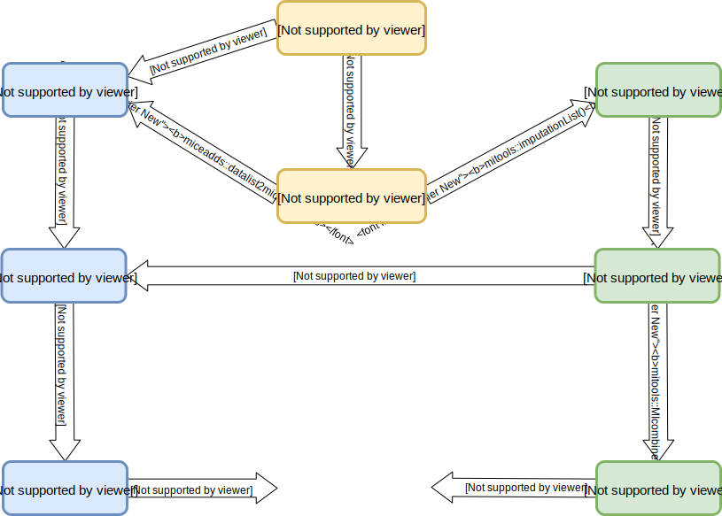

```{r, include = F}
if (names(rmarkdown::metadata$output) == "learnr::tutorial") {
  library(learnr)
  learnr::initialize_tutorial()
  static <- FALSE
}

if (names(rmarkdown::metadata$output) == "html_document") {
  knitr::opts_hooks$set(eval = function(opt) {
    if (any(opt$exercise))
      opt$eval <- opt$include <- FALSE
    
    opt
  })
  
  static <- TRUE
  
  options(width = 100)
}
```


```{r packages, include = FALSE}
library(mice)
library(miceadds)
library(mitools)
library(plyr)

# library(kableExtra)
library(knitr)
# library(JointAI)
# library(ggplot2) # for propplot & JointAI
# library(RColorBrewer) # for propplot
# library(reshape2) # for propplot
```


```{r load_data, context="data", include=FALSE}
# load("www/NHANES_for_practicals_2.RData")
# source("www/propplot.R")
load("www/imps.RData")
imp <- savedimps_imp
```


## Preface {data-progressive=FALSE}
### R packages

```{r, eval = static, echo = FALSE, results = 'asis'}
cat('In this practical, a number of R packages are used.
If any of them are not installed you may be able to follow the practical
but will not be able to run all of the code. The packages used (with versions
that were used to generate the solutions) are:')
```
```{r, eval = !static, echo = FALSE, results = 'asis'}
cat('In this practical, a number of R packages are used.
    The names of the packages used (and their version numbers available on this platform) are:')
```

* `r R.version.string`
* `mice` (version: `r packageVersion("mice")`)
* `mitools` (version: `r packageVersion("mitools")`)
* `miceadds` (version: `r packageVersion("miceadds")`)
* `plyr` (version: `r packageVersion("plyr")`)


### Help files
You can find help files for any function by adding a `?` before the name of the 
function.
```{r, eval = !static, results = 'asis', echo = FALSE}
cat("The files might look a bit funny when they are displayed as R output.")
```

Alternatively, you can look up the help pages online at 
[https://www.rdocumentation.org/](https://www.rdocumentation.org/)
or find the whole manual for a package at
[https://cran.r-project.org/web/packages/available_packages_by_name.html](https://cran.r-project.org/web/packages/available_packages_by_name.html)


### Dataset & imputed data

For this practical, we will again use the **NHANES** dataset that we have seen in
previous practicals.
```{r, eval = !static, echo = FALSE, results = 'asis'}
cat("In the interactive version of this practical, the data is already loaded
    and the variable `educ` correctly coded as an ordered factor.")
```
```{r, eval = static, echo = FALSE, results = 'asis'}
cat(
'Download the file `NHANES_for_practicals.RData` from [here](https://nerler.github.io/EP16_Multiple_Imputation/practical/data/index.html).
To load this dataset, you can use the command `file.choose()` which opens the
explorer and allows you to navigate to the location of the file
`NHANES_for_practicals.RData` on your computer.
If you know the path to the file, you can also use `load("<path>/NHANES_for_practicals.RData")`.'
)
```


To save some time, we will work with the `mids` object called `imp` that we
created in the practical [Multiple Imputation using MICE](https://nerler.github.io/EP16_Multiple_Imputation/practical/mimice/EP16_MImice.html).
```{r, eval = !static, echo = FALSE, results = 'asis'}
cat("`imp` is already loaded in this interactive version of this practical.")
```
```{r, eval = static, echo = FALSE, results = 'asis'}
cat(
'You can load it into your workspace by clicking the object `saved_imps.RData` 
if you are using RStudio.
Alternatively, you can load this workspace using `load("<path>/saved_imps.RData")`.
You then need to run:')
```
```{r, eval = TRUE, echo = static}
imp <- savedimps_imp
```

### Aim of this practical
Working with multiply imputed data can get a lot more complex, for example,
when the research question cannot be answered by just one regression model,
or when the data need some further processing after imputation.

In the lecture, we have seen that the *mice* package allows post-processing of
variables, but for more complex calculations it is often more convenient to
perform them after imputation.

When data have been imputed with a different R package, but you want to use the
convenient functions of the *mice* package, the imputed data needs to be 
converted to `mids` or `mira` objects first.

The focus of this practical is on functions to convert multiply imputed data between
different formats. An overview of possible workflows and the necessary functions
is given in this flow diagram:




## Adding a filter variable after imputation with **mice** {.tabset .tabset-fade .tabset-pills}
Assume that for a secondary research question we want to analyse a subset of the
imputed data: subjects without hypertension.

We define subjects as hypertensive if they have 

* systolic blood pressure above 140, or
* diastolic blood pressure above 90, or
* take medication for hypertension.

How can we select the correct cases for the analysis?

The standard functions for regression models (e.g. `lm`, `glm`, `lme`, ...)
have an argument `subset` that allows the specification of an expression that 
defines the subset, i.e. a "filter". The expression should return a `logical` value
(`TRUE` or `FALSE`), and only cases for which the value is `TRUE` are included
in the analysis.

When the criterion consists of multiple variables it can be useful to pre-calculate
it, so that we can easily check if our filter does what it is supposed to.

```{r, eval = static, echo = FALSE}
asis_output("### Task 1\\n")
```

Since the imputed data is a `mids` object we first need to convert it to a
`data.frame`. This can be done with the function `complete()` from the **mice**
package.

```{r, eval = static, echo = FALSE}
asis_output('<div style="border:2px; border-style:solid; padding: 1em; border-color:#446E9B">')
```

Convert `imp` to a long-format `data.frame` in which the original data and 
all imputed datasets are stacked onto each other.

```{r midstodf, exercise = TRUE}
imp_long <- ...
```

```{r, eval = static, echo = FALSE}
asis_output("</div>")

asis_output("### Solution 1\\n")
```

```{r, midstodf-solution, eval = static}
library(mice)
imp_long <- complete(imp, action = 'long', include = TRUE)
```

Some packages may not return the imputed data in long format but as a list of
data frames. In that case you can use the function `datalist2mids` to
create from the R package **miceadds** to create a `mids` object.

Alternatively, you can use `do.call(rbind, <list of data.frames>)` to convert 
the list of data frames into one long format data frame to then use `as.mids()`.
You need to make sure that
 
* the list contains the original data
* there are variables identifying the imputation number and subject id in each
  `data.frame`

```{r, eval = static, echo = FALSE}
asis_output("### Task 2\\n")
```

```{r, eval = static, echo = FALSE}
asis_output('<div style="border:2px; border-style:solid; padding: 1em; border-color:#446E9B">')
```

* Calculate a filter variable `hypten_filter` that separates cases with hypertension
   (`SBP > 140` or `DBP > 90` or `HyperMed == 'yes'`) from the other cases.
   Cases where `HyperMed` is missing should be classified based on `SBP` and `DBP` only.
* Check that the filter does what it is supposed to, for example with the help of a table.


```{r makefilter, exercise = TRUE}
imp_long$hypten_filter <- ...
```


```{r makefilter_hint, eval = static, results = 'asis', echo = FALSE}
cat('<button type="button" class="btn btn-info btn-sm" data-toggle="collapse" data-target="#makefilter">Hint</button>
<div id = "makefilter" class="collapse" style="border:1px; border-style:solid; padding: 1em; border-color:#1F78B4">
Take care of the missing values in `HyperMed`.
`HyperMed == "yes"` will return `NA` if `HyperMed` is `NA`.
</div>')
```


```{r, eval = static, echo = FALSE}
asis_output("</div>")

asis_output("### Solution 2\\n")
```

```{r makefilter-solution, eval = static}
imp_long$hypten_filter <- with(imp_long,
                               factor(
                                 ifelse(SBP <= 140 & DBP <= 90 & (HyperMed != "yes" | is.na(HyperMed)),
                                        "no", "yes")))
```

We can check that the filter variable does what it is supposed to by creating
a table:
```{r}
plyr::ddply(imp_long, c('HyperMed', "SBP > 140", "DBP > 90"), plyr::summarize,
            N = length(hypten_filter),
            'yes' = sum(hypten_filter == 'yes'),
            'no' = sum(hypten_filter == 'no'))
```

**Note:**<br>
Subjects for whom `SBP` or `DBP` is imputed may be classified to have hypertension
in some sets but not in other, so that the number of subjects in the
analysis of the subset will differ between imputed datasets. This may complicate
subsequent analyses.

```{r}
with(imp_long, table(hypten_filter, .imp, exclude = NULL))
```


```{r, eval = static, echo = FALSE}
asis_output("### Task 3\\n")
```

```{r, eval = static, echo = FALSE}
asis_output('<div style="border:2px; border-style:solid; padding: 1em; border-color:#446E9B">')
```

* Convert the data back to a `mids` object using the function `as.mids()` from
the **mice** package.
* Analyse and pool the data using the logistic regression with model formula
`DM ~ gender + race + age + chol + SBP + WC`, restricted to cases without
hypertension.


```{r subanalysis, exercise = TRUE}

imp_mids <- ...

```

```{r subanalysis_hint, eval = static, results = 'asis', echo = FALSE}
cat('<button type="button" class="btn btn-info btn-sm" data-toggle="collapse" data-target="#subanalysis">Hint</button>
<div id = "subanalysis" class="collapse" style="border:1px; border-style:solid; padding: 1em; border-color:#1F78B4">
Use `subset = hypten_filter == "no"` to select cases without hypertension.
</div>')
```


```{r, eval = static, echo = FALSE}
asis_output("</div>")

asis_output("### Solution 3\\n")
```

```{r subanalysis-solution, eval = static}
imp_mids <- as.mids(imp_long)

subres <- with(imp_mids,
               glm(DM ~ gender + race + age + chol + SBP + WC,
                   family = binomial(),
                   subset = hypten_filter == 'no'))

summary(pool(subres), conf.int = TRUE)

```

If you want to check if the analysis was indeed performed on the subset only,
you can check the length of the fitted values from each analysis:

```{r}
sapply(subres$analyses, function(x) length(x$fitted.values))
```


## Another way of pooling {.tabset .tabset-fade .tabset-pills}
The function `pool()` from the **mice** package is not the only function that
performs pooling using Rubin's rules. The package **mitools** also provides this
functionality.

The diagram above shows how to obtain pooled results using **mitools**.

```{r, eval = static, echo = FALSE}
asis_output("### Task 1\\n")
```

```{r, eval = static, echo = FALSE}
asis_output('<div style="border:2px; border-style:solid; padding: 1em; border-color:#446E9B">')
```

* Split the data by imputation number using the function `split()`.
* Convert the resulting list to an object of class `imputationList`.
  The `imputationList` should only contain the imputed data, not the original data.

```{r splitlongdat, exercise = TRUE}

imp_list <- ...

```


```{r splitlongdat_hint, eval = static, results = 'asis', echo = FALSE}
cat('<button type="button" class="btn btn-info btn-sm" data-toggle="collapse" data-target="#splitlongdat">Hint</button>
<div id = "splitlongdat" class="collapse" style="border:1px; border-style:solid; padding: 1em; border-color:#1F78B4">
To exclude an element from a list, say the first element, use `<name of the list object>[-1]`.
</div>')
```


```{r, eval = static, echo = FALSE}
asis_output("</div>")

asis_output("### Solution 1\\n")
```

```{r splitlongdat-solution}
imp_list <- imputationList(split(imp_long, imp_long$.imp)[-1])
```


```{r, eval = static, echo = FALSE}
asis_output("### Task 2\\n")
```

```{r, eval = static, echo = FALSE}
asis_output('<div style="border:2px; border-style:solid; padding: 1em; border-color:#446E9B">')
```

* Analyse each of the imputed datasets in `imp_list` using `with()`.
* Pool the results using `MIcombine()` and obtain the `summary()` of the pooled
results.

```{r reslist, exercise = TRUE}

reslist <- ...

```

```{r, eval = static, echo = FALSE}
asis_output("</div>")

asis_output("### Solution 2\\n")
```

```{r reslist-solution}
reslist <- with(imp_list, glm(DM ~ gender + race + age + chol + SBP + WC,
                   family = binomial(),
                   subset = hypten_filter == 'no'))

summary(MIcombine(reslist))

```

